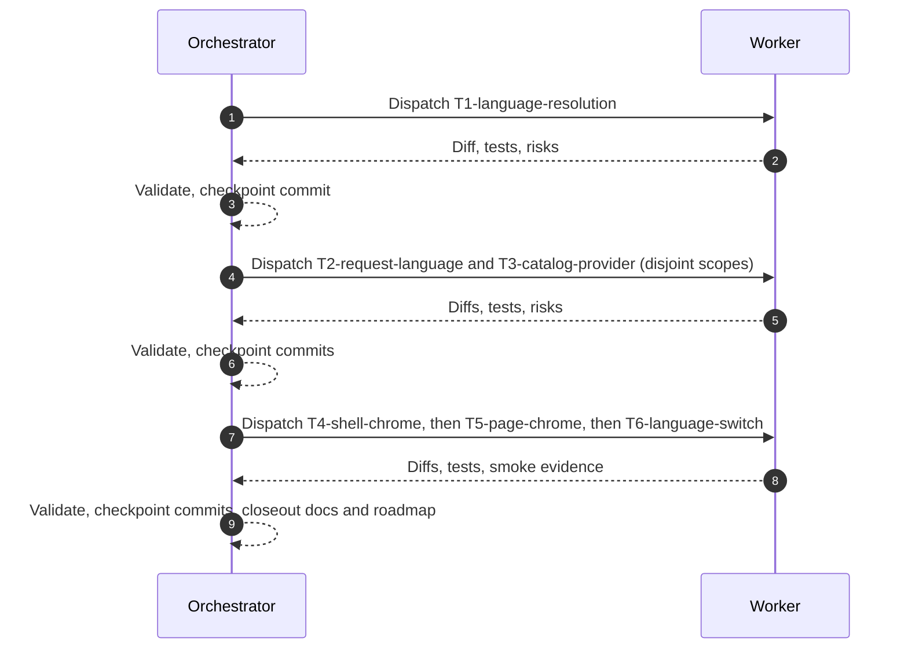

# Plan: Frontend Internationalization (M-I18N-001)

Plan-ID: PLAN-frontend-i18n

Status: Approved

Workers: 1

Clean verifier: None declared.

Filename: `.agents/plans/PLAN-frontend-i18n.md`

## Readiness

- Plan readiness: Ready for execution; open questions resolved by the user with the recommended options.
- Approved by: user (chat session, "take the recommendations")
- Approved at: 2026-06-11
- Open questions: None; resolutions recorded in `## Open Questions`.
- Implementation progress: Not started.

Use `Status: Draft` while shaping the plan. Use `Status: Approved` only after explicit user approval is recorded. Creating or updating this plan is not implementation approval.

## Status History

- 2026-06-11: none -> Draft by AI agent; plan created from `ROADMAP.md` milestone `M-I18N-001` at user request.
- 2026-06-11: Draft -> Approved by user ("take the recommendations"); open questions 1-3 resolved with the recommended options and the Open Question 4 roadmap Release Context update applied.

## Goal

Render the frontend UI in the user's resolved language using the backend localization mechanism: resolve the active language from account preference, then the backend `language` cookie, then browser locale, restricted to the backend-supported set with English fallback (T-I18N-001); send the resolved language on API requests so backend payloads match the UI (T-I18N-002); load frontend chrome strings from the public backend localization catalog with English fallback (T-I18N-003); route shell, navigation, catalog, account, and admin chrome strings through that lookup (T-I18N-004); and apply a language change from the account preference control or anonymous selection within the same session (T-I18N-005).

## Non-Goals

- No new backend endpoints, request fields, or negotiation rules; language negotiation uses the existing `Accept-Language` header and `language` cookie per `docs/backend/`.
- No third-party i18n framework (i18next, react-intl, FormatJS); the milestone needs a small catalog-backed lookup, and a framework would add bundle weight and a parallel message-file format the backend catalog does not use.
- No translation content authoring or seeding in the real backend; the admin localization page remains the content path. Mock-API seed rows exist only so tests and smoke evidence can prove localized rendering.
- No operator-page internal strings (`src/operator/`); the roadmap scopes shell, navigation, catalog, account, and admin chrome. Operator surfaces pick up shell and shared-component localization for free and follow as later scope.
- No locale-aware date or number reformatting changes; `src/ui/format.ts` already uses runtime-locale `Intl` formatting.
- No `lang` query-parameter surface and no URL-based language routing.

## Source Artifacts

- User request: "make a plan for M-I18N-001" (chat, 2026-06-11).
- Roadmap refs: `M-I18N-001`, `E-I18N-001` (T-I18N-001, T-I18N-002, T-I18N-003), `E-I18N-002` (T-I18N-004, T-I18N-005).
- Design/spec refs: `docs/DESIGN.md` (chrome copy ownership; update alongside T4/T5 if product intent wording changes).
- Backend contract refs: `docs/backend/FRONTEND_AI_CONTRACT.md` (supported languages `en es de fr pl uk no`; `Accept-Language`/`lang`/cookie `language` negotiation; `messageKey` as the stable branching field); `docs/backend/approved-openapi.json` (`GET /api/localizations` with `messageKey`/`language`/`page`/`size`/`sort` params, `PUT /api/account/language`, `UserAccountResponse.preferredLanguage`, `LocalizationResponse`).
- Focused references: `.agents/references/execution.md`, `.agents/references/plan-execution.md`, `.agents/references/testing.md`, `.agents/references/reviews.md`.
- Source files or tests: `src/api/http.ts`, `src/api/localizations.ts`, `src/api/account.ts`, `src/account/languageOptions.ts`, `src/account/AccountProfile.tsx`, `src/account/useCurrentAccount.ts`, `src/App.tsx`, `src/main.tsx`, `src/mock-api/handler.ts`, shared `src/ui/` components, page modules under `src/catalog/` and `src/admin/`, plus their colocated tests.

## Assumptions

- The backend `language` cookie is a plain readable cookie, not `HttpOnly`; resolution reads it from `document.cookie` and degrades by skipping that tier when unreadable. Owner: `docs/backend/` refresh per `docs/backend/README.md`; revisit if backend REST Docs state otherwise.
- The localization catalog for one language fits a few pages; the loader requests `size=200` and follows pagination until `last`. The contract documents no maximum `size`; revisit if the backend rejects the size.
- Frontend chrome English defaults live in code and stay byte-identical to today's literals, so missing catalog rows render exactly the current UI and existing literal-string test assertions keep passing.
- Frontend chrome keys use the `ui.<area>.<slug>` convention within the contract's `^[a-z0-9._-]+$` pattern and 150-char limit; singular/plural variants use distinct keys.
- A catalog fetch failure is non-fatal: the UI renders English defaults and does not block the shell on the localization request.

## Open Questions

All resolved by the user on 2026-06-11 ("take the recommendations"):

1. Anonymous selection persistence (T-I18N-005): the frontend writes the backend `language` cookie (`Path=/`, `SameSite=Lax`, `Max-Age` one year) so backend negotiation and the UI agree for anonymous sessions; fall back to `localStorage` only if the cookie proves unwritable (see `## Risks`).
2. `Accept-Language` request format (T-I18N-002): send exactly the resolved two-letter code, replacing today's raw browser-list pass-through, so backend resolution deterministically matches the UI.
3. Admin chrome breadth (T-I18N-004): all static UI strings on the listed surfaces (headings, nav, buttons, table headers, form labels, empty/loading states, aria-labels) are chrome; backend-provided content and localized backend messages stay excluded.
4. `ROADMAP.md` Release Context `Active product plans` references `PLAN-frontend-i18n`; applied alongside this approval.

## Proposed Changes

- New `src/i18n/` module:
  - `resolveLanguage.ts`: pure resolution from explicit inputs (account `preferredLanguage`, cookie source, browser languages) to a supported language with `en` fallback (T-I18N-001).
  - `messages.ts`: the registry of frontend chrome keys with English default text; single owner of the key list (T-I18N-003).
  - `catalog.ts`: loads all `LocalizationResponse` rows for one language through the existing `fetchLocalizations` client, following pagination (T-I18N-003).
  - `I18nProvider.tsx` with a `useI18n()` hook exposing the active language and `t(key, params?)`: catalog text when present and non-blank, English default otherwise, with `{name}` placeholder interpolation (T-I18N-003).
- `src/api/http.ts`: an active-language holder set by the provider; `createJsonReadHeaders` sends the resolved language once set (browser-list fallback before resolution), and mutation helpers across `src/api/` gain the same `Accept-Language` header (T-I18N-002).
- `src/main.tsx`: mount `I18nProvider` around `App`.
- `src/App.tsx`, shared `src/ui/` components, `src/catalog/`, `src/account/`, `src/admin/` pages: replace literal chrome strings with `t(...)` lookups, including `document.title` and aria-labels (T-I18N-004).
- `src/App.tsx` and `I18nProvider.tsx`: language switching — re-resolve and refetch on account preference updates via the existing `publishAccountUpdate` channel, and an anonymous topbar language selector that persists per Open Question 1 (T-I18N-005).
- `src/mock-api/handler.ts`: seed `pl` (and one more language) chrome catalog rows so tests and smoke can prove localized rendering and fallback.
- Tests at the smallest useful layer: resolution unit tests, catalog paging/fallback unit tests, provider rendering tests, and updated page tests where copy routing changes.
- `docs/DESIGN.md` and `CHANGELOG.md` updates at closeout for the user-visible language behavior.

## Contract And Repository Invariants

- Route API-facing behavior through `docs/backend/`; do not invent endpoints, request fields, or negotiation rules beyond `Accept-Language` and the `language` cookie.
- Preserve same-origin `/api/**`, session-cookie auth, CSRF header mirroring on writes, Spring pagination conventions, and versioned update invariants.
- Keep `messageKey` and status codes as the stable branching fields; localized text is display content only.
- Run `git status --short` before edits; treat existing changes (currently untracked `.run/`) as user-owned.
- Commit only at authorized packet checkpoints; keep unrelated files out of each commit.

## Clean Verifier

- Declared verifier: none.

## Progress Tracker

| Packet                 | Status   | Owner       | Depends On | Last Updated | Notes                                 |
| ---------------------- | -------- | ----------- | ---------- | ------------ | ------------------------------------- |
| T1-language-resolution | Complete | Coordinator | None       | 2026-06-11   | T-I18N-001; pure resolution module    |
| T2-request-language    | Ready    | Coordinator | T1         | 2026-06-11   | T-I18N-002; resolved language on API  |
| T3-catalog-provider    | Ready    | Coordinator | T1         | 2026-06-11   | T-I18N-003; catalog load + provider   |
| T4-shell-chrome        | Waiting  | Coordinator | T3         | 2026-06-11   | T-I18N-004; shell, nav, shared ui     |
| T5-page-chrome         | Waiting  | Coordinator | T4         | 2026-06-11   | T-I18N-004; catalog, account, admin   |
| T6-language-switch     | Waiting  | Coordinator | T5         | 2026-06-11   | T-I18N-005; same-session switch, anon |

T1 is `Ready`; later packets promote to `Ready` as their predecessors land per the dependency order.

## Task Packets

### Task Packet: T1-language-resolution (Complete)

Task id: T1-language-resolution (roadmap T-I18N-001)

Lane: implementation

Goal:

- Add `src/i18n/resolveLanguage.ts`: a pure function resolving the active UI language from account `preferredLanguage`, then a `language` cookie value parsed from a cookie source string, then browser languages, restricted to `SUPPORTED_LOCALIZATION_LANGUAGES` (imported from `src/api/localizations.ts`) with `en` fallback. Region tags like `pl-PL` map to their base language when supported.

Initial context budget:

- Read first: this packet, `src/api/localizations.ts` (supported-language export), `src/api/session.ts` (existing cookie parsing to reuse or mirror), `docs/backend/FRONTEND_AI_CONTRACT.md` localization section.
- Escalate to: backend REST Docs via `docs/backend/README.md` refresh procedure if cookie semantics are unclear.

Write scope:

- `src/i18n/resolveLanguage.ts`, `src/i18n/resolveLanguage.test.ts`.

Dependencies:

- None; plan approved 2026-06-11.

Validation:

- `npm run lint`, `npm run typecheck`, `npm test`, `npm run build`, `git diff --check`.
- Commit checkpoint: `feat(i18n): resolve the active UI language from preference, cookie, and locale` before T2/T3 start.

Escalation triggers:

- Backend contract ambiguity about the `language` cookie name or format.

Stop conditions:

- Dirty changes inside `src/i18n/` before editing; needing edits outside write scope.

Expected output:

- Changed files, validation evidence, commit id, blockers, review risks, handoff notes.

Result summary:

- Status: Complete (2026-06-11)
- Worker: session agent (direct execution mode)
- Changed files: `src/i18n/resolveLanguage.ts`, `src/i18n/resolveLanguage.test.ts` (new); reuses `readCookie` from `src/api/session.ts` and `SUPPORTED_LOCALIZATION_LANGUAGES` from `src/api/localizations.ts`.
- Validation: `npm run lint`, `npm run typecheck`, `npm test` (212 passed), `npm run build`, `git diff --check` — all green.
- Self-review: pure module, no API-facing or owner-doc changes; region tags map to base language; unsupported values skip a tier instead of aborting resolution.
- Commit: see checkpoint below.
- Blockers: none.
- Review risks: none beyond plan-level risks.
- Handoff: T2 and T3 promoted to `Ready`.

### Task Packet: T2-request-language

Task id: T2-request-language (roadmap T-I18N-002)

Lane: implementation

Goal:

- Send the resolved language on API requests: add an active-language holder in `src/api/http.ts` (set by the provider in T3; browser-list behavior unchanged until set), route `createJsonReadHeaders` through it, and add the same `Accept-Language` header to mutation request helpers in `src/api/account.ts`, `src/api/catalog.ts`, `src/api/localizations.ts`, and `src/api/adminUsers.ts` per Open Question 2's resolved format.

Initial context budget:

- Read first: this packet, `src/api/http.ts`, the mutation helpers in the four API modules and their tests.
- Escalate to: `docs/backend/approved-openapi.json` for per-operation header expectations.

Write scope:

- `src/api/http.ts`, `src/api/account.ts`, `src/api/catalog.ts`, `src/api/localizations.ts`, `src/api/adminUsers.ts`, and their colocated tests.

Dependencies:

- T1 committed.

Validation:

- Full baseline (lint, typecheck, test, build, `git diff --check`).
- Commit checkpoint: `feat(api): send the resolved language on API requests` before T4.

Escalation triggers:

- Any endpoint whose generated types or tests imply different header handling.

Stop conditions:

- Contract conflict on header semantics; edits needed outside the API layer.

Expected output:

- Changed files, validation evidence, commit id, blockers, review risks, handoff notes.

Result summary:

- Status: pending

### Task Packet: T3-catalog-provider

Task id: T3-catalog-provider (roadmap T-I18N-003)

Lane: implementation

Goal:

- Add `src/i18n/messages.ts` (chrome key registry with English defaults), `src/i18n/catalog.ts` (load all rows for one language via `fetchLocalizations`, `size=200`, follow pages until `last`), and `src/i18n/I18nProvider.tsx` (resolve language with T1, load catalog, expose `useI18n()` with `t(key, params?)`, English fallback for missing keys, blank text, or fetch failure; set the T2 active-language holder). Mount the provider in `src/main.tsx`. Seed mock-API `pl` chrome rows plus a second language with deliberate gaps to exercise fallback.

Initial context budget:

- Read first: this packet, T1/T2 results, `src/api/localizations.ts`, `src/mock-api/handler.ts` seed shape, `src/main.tsx`.
- Escalate to: `src/account/useCurrentAccount.ts` for the account-state access pattern.

Write scope:

- `src/i18n/messages.ts`, `src/i18n/catalog.ts`, `src/i18n/I18nProvider.tsx`, colocated tests, `src/main.tsx`, `src/mock-api/handler.ts`, `src/mock-api/handler.test.ts`.

Dependencies:

- T1 committed (T2 may land in parallel but the provider sets the T2 holder when both exist).

Validation:

- Full baseline; provider tests cover catalog hit, missing key fallback, blank text fallback, fetch-failure fallback, and interpolation.
- Commit checkpoint: `feat(i18n): load chrome strings from the backend localization catalog` before T4.

Escalation triggers:

- Catalog paging behavior conflicting with the OpenAPI page schema.

Stop conditions:

- Provider design forcing edits to page modules ahead of T4/T5 scope.

Expected output:

- Changed files, validation evidence, commit id, blockers, review risks, handoff notes.

Result summary:

- Status: pending

### Task Packet: T4-shell-chrome

Task id: T4-shell-chrome (roadmap T-I18N-004, shell slice)

Lane: implementation

Goal:

- Route shell and navigation chrome through `t(...)`: `src/App.tsx` (brand, skip link, nav links and menus, route context titles/areas/descriptions, `document.title`, session/account/login/logout strings, theme labels, quick-language labels) and shared `src/ui/` component strings (`PaginationControls`, `StateBlock`, `ConfirmDialog`, `MutationFeedback`, `SortableColumnHeader`, `Tabs`), registering keys in `messages.ts` with today's literals as defaults.

Initial context budget:

- Read first: this packet, T3 result, `src/App.tsx`, the shared `src/ui/` components and tests.
- Escalate to: `docs/DESIGN.md` if copy ownership questions appear.

Write scope:

- `src/App.tsx`, `src/App.test.tsx`, shared `src/ui/` components and their tests, `src/i18n/messages.ts`.

Dependencies:

- T3 committed.

Validation:

- Full baseline; `npm run a11y` (aria-label strings change); responsive sweep at 375/768/1280 via `preview_eval` against mock mode for menu/nav overflow with longer `pl`/`de` strings.
- Commit checkpoint: `feat(shell): localize shell and navigation chrome through the catalog` before T5.

Escalation triggers:

- A string that is backend content rather than chrome; aria pattern questions.

Stop conditions:

- Layout breakage from translated lengths that needs CSS changes beyond minor wrapping fixes inside scope.

Expected output:

- Changed files, validation and a11y/responsive evidence, commit id, blockers, review risks, handoff notes.

Result summary:

- Status: pending

### Task Packet: T5-page-chrome

Task id: T5-page-chrome (roadmap T-I18N-004, page slice)

Lane: implementation

Goal:

- Route catalog, account, and admin page chrome through `t(...)` per the Open Question 3 breadth decision: `src/catalog/CatalogPanel.tsx` and `CategoryFilter.tsx`, `src/account/AccountProfile.tsx` and `languageOptions.ts` labels, `src/admin/AdminCatalogPage.tsx`, `AdminLocalizationPage.tsx`, `AdminUsersPage.tsx`, registering keys with today's literals as defaults. Singular/plural summary strings use distinct keys with interpolation.

Initial context budget:

- Read first: this packet, T4 result, the listed page modules and their tests.
- Escalate to: `docs/DESIGN.md` for copy intent; `docs/specs/` if a page has a behavior spec touching wording.

Write scope:

- The listed `src/catalog/`, `src/account/`, `src/admin/` modules and their colocated tests, `src/i18n/messages.ts`.

Dependencies:

- T4 committed.

Validation:

- Full baseline; spot responsive sweep via `preview_eval` on the densest admin tables with `pl` active.
- Commit checkpoint: `feat(pages): localize catalog, account, and admin chrome through the catalog` before T6.

Escalation triggers:

- Strings produced by helper functions shared with operator pages (out of scope) needing a seam.

Stop conditions:

- Breadth ambiguity not settled by Open Question 3's resolution.

Expected output:

- Changed files, validation evidence, commit id, blockers, review risks, handoff notes.

Result summary:

- Status: pending

### Task Packet: T6-language-switch

Task id: T6-language-switch (roadmap T-I18N-005)

Lane: implementation

Goal:

- Apply language changes within the same session: the provider re-resolves and refetches the catalog when the account preference changes (subscribe to the existing `publishAccountUpdate` channel used by `QuickLanguageMenu` and `AccountProfile`), and anonymous visitors get the topbar language selector (currently authenticated-only) persisting per Open Question 1's resolution so backend negotiation and the UI agree.

Initial context budget:

- Read first: this packet, T3-T5 results, `src/App.tsx` `QuickLanguageMenu`, `src/account/useCurrentAccount.ts` publish/subscribe shape, `src/account/AccountProfile.tsx`.
- Escalate to: `.agents/references/reviews.md` security-review section before cookie-write implementation.

Write scope:

- `src/i18n/I18nProvider.tsx` and tests, `src/App.tsx`, `src/App.test.tsx`, `src/account/AccountProfile.tsx` and test if wiring requires it.

Dependencies:

- T5 committed.

Validation:

- Full baseline; `npm run smoke:authenticated`; mock-browser evidence via `preview_eval`: switch language as admin and verify chrome re-renders localized in-session, then anonymous selection after logout; security self-review for the cookie write per `.agents/references/reviews.md`.
- Commit checkpoint: `feat(i18n): apply language changes in-session for account and anonymous selection`; final packet.

Escalation triggers:

- Cookie attributes conflicting with backend-set cookie behavior observed in smoke.

Stop conditions:

- Open Question 1 unresolved; observed backend `HttpOnly` cookie contradiction.

Expected output:

- Changed files, validation and smoke evidence, commit id, blockers, review risks, handoff notes including `docs/DESIGN.md`/`CHANGELOG.md` closeout updates.

Result summary:

- Status: pending

## Execution Model

- `Workers: 1`; packets run sequentially in dependency order (T1, then T2 and T3, then T4, T5, T6). T2 and T3 have disjoint write scopes and may run as a parallel wave if delegated.
- Active-plan implementation uses a coordinator plus one fresh implementation worker per repository-changing packet per `.agents/references/plan-execution.md`; if worker subagents are unavailable or the user directs direct execution, record that mode here before starting.
- Execution mode recorded 2026-06-11: direct execution by the session agent. The active tool contract directs against spawning subagents unless the user asks, matching repo precedent from `PLAN-graphical-review-fixes`; packet sequencing, validation, and checkpoints stay as planned.
- Each packet must be implemented, validated through `.agents/references/testing.md`, self-reviewed through `.agents/references/reviews.md`, and committed at its checkpoint before dependent packets start.
- Keep compact evidence in this plan; no raw test output or browser logs.

## Long-Run Continuity

- Resume docs reread: latest user request, `AGENTS.md`, this plan's header and `## Readiness`, the current packet and its result summary, `.agents/references/plan-execution.md`, `.agents/references/testing.md`.
- Current task or wave: T1-language-resolution is next; implementation not started.
- Completed commits: none (draft plan committed by the user as a0be7f1).
- Plan status and readiness: Approved 2026-06-11; T1 `Ready`.
- Validation and self-review state: not started.
- Coordinator reconciliation state: not started.
- Changelog, docs, spec, roadmap, or plan updates: `ROADMAP.md` Release Context `Active product plans` now references this plan.
- Blockers or open questions: none.
- Next action: execute T1-language-resolution when the user authorizes plan implementation.
- Context handoff notes: none.

## Execution Graph

| Packet                 | State   | Dispatch | Return  | Orchestrator closeout | Checkpoint / next action |
| ---------------------- | ------- | -------- | ------- | --------------------- | ------------------------ |
| T1-language-resolution | Pending | Pending  | Pending | Pending               | Pending                  |
| T2-request-language    | Pending | Pending  | Pending | Pending               | Pending                  |
| T3-catalog-provider    | Pending | Pending  | Pending | Pending               | Pending                  |
| T4-shell-chrome        | Pending | Pending  | Pending | Pending               | Pending                  |
| T5-page-chrome         | Pending | Pending  | Pending | Pending               | Pending                  |
| T6-language-switch     | Pending | Pending  | Pending | Pending               | Pending                  |

## Validation Plan

- Every packet: `npm run lint`, `npm run typecheck`, `npm test`, `npm run build`, `git diff --check` (app-source baseline from `.agents/references/testing.md`).
- T4: `npm run a11y` and a 375/768/1280 responsive sweep via `preview_eval` with a non-English language active.
- T6: `npm run smoke:authenticated` plus mock-browser language-switch evidence via `preview_eval` (preview screenshots are unreliable in this environment; use DOM assertions).
- Server hygiene per `.agents/references/testing.md`: `npm run dev:list` before and after browser checks; `npm run dev:cleanup` for task-owned servers.
- Skipped checks must be reported with reasons in packet result summaries.

## Review Expectations

- Backend contract drift review on T2 and T3 (request headers and localization catalog usage are API-facing).
- Security review on T6 if the anonymous selection writes the `language` cookie (cookie handling change beyond restating invariants).
- Owner-drift review at closeout: `docs/DESIGN.md` for the language behavior, `CHANGELOG.md` for the user-visible feature, `ROADMAP.md` milestone status and Release Context, archive routing per `.agents/references/roadmap.md`.

## Risks

- The backend `language` cookie may be `HttpOnly` or carry attributes that conflict with a frontend write; resolution degrades to preference-then-browser and anonymous persistence needs the Open Question 1 fallback (`localStorage`) if so.
- Translated strings (notably `de`, `fr`, `uk`) are longer than English and can wrap or overflow the topbar, menus, and dense admin tables; the user requires stable layouts, so T4/T5 include responsive sweeps and minor wrapping fixes in scope.
- The real backend catalog has no frontend chrome translations until content is seeded, so production rendering stays English until then; acceptance only requires correct fallback, but demoable behavior depends on mock seeds or admin-entered rows.
- Many existing tests assert literal English copy; keeping code defaults byte-identical to current literals contains the churn, but tests that render through the provider may need an i18n-aware test wrapper.
- Changing `Accept-Language` from the browser list to the resolved code alters localized backend payloads for users with regional browser locales; this is the milestone's intent but should be called out in the changelog.

## Handoff Notes

- Approval recorded 2026-06-11 with the recommended options; T1 promoted to `Ready` and the roadmap Release Context updated in the same change. Plan approval is not implementation authorization; execution starts per `.agents/references/plan-execution.md` when the user asks to implement this plan.
- At closeout: move `M-I18N-001` per `.agents/references/roadmap.md` (milestone summary to `docs/ROADMAP_ARCHIVE.md` when it leaves the active roadmap), update `CHANGELOG.md`, and record durable i18n rules in their owners (`docs/DESIGN.md` for behavior, `docs/backend/` stays authoritative for negotiation).
