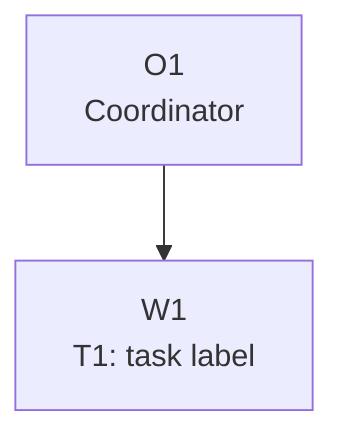

# Plan: [Plan Title]

Plan-ID: PLAN-<short-kebab-slug>

Status: Draft

<!-- For Status: Closed, add `Close-Reason: Released|Rejected|Superseded|Deferred|Archived`. -->

Workers: 1

Filename: `.agents/plans/PLAN-<short-kebab-slug>.md`

## Readiness

- Plan readiness: Not ready until open questions, owner routing, validation, and required decisions are resolved.
- Approved by:
- Approved at:
- Open questions: Yes; see `## Open Questions`.
- Implementation progress: Not started.

Use `Status: Draft` while shaping the plan. Use `Status: Approved` only after explicit user approval is recorded. Creating or updating this plan is not implementation approval.

## Status History

- YYYY-MM-DDTHH:mm:ss+HH:mm: none -> Draft by [actor]; plan created.

## Goal

State the frontend behavior, repository rule, release state, or execution outcome this plan should achieve.

## Non-Goals

- List work that is intentionally out of scope.
- Do not include unrelated cleanup, generic command wrappers, broad workflow-state directories, or reusable process scaffolding unless selected roadmap work names that need.

## Source Artifacts

- User request:
- Roadmap refs:
- Design/spec refs:
- Backend contract refs:
- Focused references:
- Source files or tests:

Load only the artifacts needed for this plan. Do not bulk-load generated contract files, source trees, archived plans, or roadmap archives unless a task packet names them or an escalation trigger fires.

## Assumptions

- Document assumptions that are safe enough to proceed with and name the owner or revisit trigger.

## Open Questions

- List task-specific questions that block approval or execution.
- Approved plans must have every question answered, moved to an owner document, or documented as an allowed assumption.

## Proposed Changes

- List files, modules, docs, tests, or generated artifacts expected to change.
- Keep this at the level of implementation steps and owner updates, not backlog history.
- Reference related roadmap IDs, specs, prompts, or source files when applicable.

## Contract And Repository Invariants

- Route API-facing behavior through `docs/backend/` and the imported backend contract artifacts before implementation.
- Do not invent endpoints, request fields, authentication flows, transport assumptions, provider-specific OAuth paths, pagination/filter semantics, or update concurrency rules.
- Preserve routine frontend/backend boundaries: same-origin `/api/**`, session-cookie auth, backend-provided session metadata, localized messages as display content, and stable-field branching.
- Move durable rules discovered during execution into the owning backend contract artifact, executable test, human doc, design guide, roadmap row, focused reference, or source file before this plan is complete.
- Run `git status --short` before edits and treat existing or unexpected changes as user-owned.
- Assign explicit write scopes to workers and keep unrelated user or parallel-worker changes intact.
- Commit only when the current request and plan checkpoint authorize it, and keep unrelated files out of the checkpoint commit.

## Progress Tracker

| Packet          | Status                               | Owner                | Depends On | Last Updated | Notes      |
| --------------- | ------------------------------------ | -------------------- | ---------- | ------------ | ---------- |
| T1-[task-label] | Ready / Waiting / Blocked / Complete | Coordinator / worker | None       | YYYY-MM-DD   | Short note |

Use `Ready` only when the packet can be assigned from the current repository state. Use `Waiting` for normal predecessor dependency. Use `Blocked` only for unresolved product choices, backend contract conflicts, credentials, selected thresholds, failure owners, explicit user acceptance gates, or external state the plan cannot produce.

## Task Packets

Use task packets for approved multi-task plans. For a single-task plan, keep one task packet so the worker assignment, validation, and result summary stay explicit.

Use inline task packets by default. For long plans with more than six worker-owned tasks, multiple parallel waves, or an expected parent-plan length above roughly 200 lines after packeting, link child packet files here and keep stable task packet refs in the parent plan.

### Task Packet: T1-[task-label]

Task id: T1-[task-label]

Lane: implementation

<!-- Use `implementation`, `design`, `exploration`, `testing`, or `review`. Design, exploration, testing, and review packets must use `Write scope: read-only` unless the plan explicitly assigns draft or test artifact edits. -->

Goal:

- State the exact task outcome.

Initial context budget:

- Read first:
  - Plan header, `## Readiness`, `## Progress Tracker`, `## Execution Model`, this task packet, and this packet's `Result summary`.
  - Exact owner artifacts and source files required for this task, such as `AGENTS.md`, `docs/DESIGN.md`, selected `ROADMAP.md` rows, `docs/backend/`, `.agents/references/testing.md`, or specific source files.
- Escalate to:
  - Exact owner guides, source files, specs, validation output, browser evidence, or backend contract artifacts allowed only when an escalation trigger fires.

Write scope:

- Exact files or directories this task may edit, or `read-only` for design, exploration, testing, and review packets without assigned artifact edits.

Dependencies:

- List predecessor task packets, wave constraints, or `none`.

Validation:

- List task-specific commands and manual checks selected through `.agents/references/testing.md`.
- List self-review checks selected through `.agents/references/reviews.md`.
- State the task or approved parallel-wave commit boundary that must exist before any dependent task or wave starts, or state that no commit is authorized.

Escalation triggers:

- Conditions that allow the worker to load additional named context, such as a missing owner, backend contract conflict, design ambiguity, validation blocker, or need to align with another owner guide.

Stop conditions:

- List missing decisions, unsafe assumptions, dirty-worktree conflicts inside write scope, owner drift, or edits outside scope that should stop work.

Expected output:

- Changed files or reviewed diff.
- Validation evidence from `.agents/references/testing.md`.
- Self-review evidence from `.agents/references/reviews.md`.
- Commit identifier when a commit checkpoint is authorized and completed.
- Coordinator reconciliation note comparing worker claims with the final diff, validation output, and governing artifact.
- Blockers.
- Review risks.
- Handoff notes and next action.

Result summary:

- Status: pending
- Worker:
- Changed files or reviewed diff:
- Validation evidence from `.agents/references/testing.md`:
- Self-review evidence from `.agents/references/reviews.md`:
- Commit:
- Coordinator reconciliation:
- Changelog/docs/spec/roadmap updates:
- Blockers:
- Review risks:
- Handoff notes and next action:

## Execution Model

- `Workers: 1` for sequential execution, or `Workers: N (parallel, tasks: <task refs or labels>)` when the approved plan marks those tasks independent with disjoint write scopes.
- Active-plan implementation uses a coordinator plus one fresh implementation worker subagent per repository-changing task packet.
- Research, exploration, planning, testing, and review subagents are optional unless this plan makes a packet mandatory.
- If required implementation worker subagents are unavailable, unauthorized by the active tool contract, or explicitly forbidden, stop before implementation and report the blocker instead of running the task locally.
- Dispatch only the plan header or readiness summary, execution graph, assigned task packet, and explicitly named governing artifacts or source files. Do not dispatch the full approved plan by default.
- Record any task that is safe to run in parallel only when it has a disjoint write scope.
- Before write delegation, check current worktree state, reserve explicit write scopes, and keep parallel write scopes disjoint.
- Each repository-changing task or approved parallel wave must be implemented, validated through `.agents/references/testing.md`, self-reviewed through `.agents/references/reviews.md`, and committed when the plan checkpoint and current request authorize a commit before the next dependent task or wave starts.
- Before starting the next dependent task or approved parallel wave, confirm every predecessor result summary records implementation status, validation evidence, self-review evidence, and any required commit identifier.
- Keep compact evidence in the plan. Do not paste raw test output, raw worker transcripts, browser logs, or bulky run logs.

## Long-Run Continuity

Use this checkpoint for multi-task, context-heavy, delegated, parallel, or likely-compaction plans. Update it before starting each dependent task or wave, before a pause or handoff, and after any context transition.

- Resume docs reread:
  - After context compaction, interruption, resume, or handoff, reread the latest user request, `AGENTS.md`, this plan's header, `## Readiness`, `## Long-Run Continuity`, `## Execution Model`, the current task packet and result summary, `.agents/references/plan-execution.md`, `.agents/references/testing.md`, `.agents/references/reviews.md`, and the next action's exact owner docs or source files.
- Current task or wave:
- Completed commits:
- Plan status and readiness:
- Validation and self-review state:
- Coordinator reconciliation state:
- Changelog, docs, spec, roadmap, or plan updates:
- Blockers or open questions:
- Next action:
- Context handoff notes:

## Execution Graph

## Validation Plan

- List commands, manual checks, browser smoke, or content reviews expected for the plan.
- Select validation through `.agents/references/testing.md`; use `docs/LOCAL_DEVELOPMENT.md` and `package.json` for command details.
- Skipped validation must be reported with reasons.

## Review Expectations

- Review for documentation and owner drift before handoff.
- Review for backend contract drift if API-facing wording, client code, generated types, auth/session/CSRF handling, localization, pagination, filters, or update behavior changes.
- Security review is required when auth, session, CSRF, permissions, headers, cookies, storage, redirects, or transport assumptions change beyond restating existing invariants.
- Findings must be fixed, delegated, or recorded with owner and risk before calling the plan complete.

## Risks

- Note backend contract, design, roadmap, validation, smoke, accessibility, hardening, release, or coordination risks.

## Handoff Notes

- Record anything the next coordinator, worker, reviewer, verifier, or maintainer should know after implementation.
- If a new question appeared during implementation, note where it was recorded and whether work resumed.
