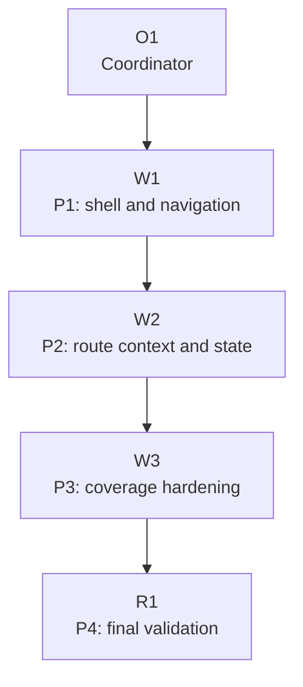

# Plan: Production UI Foundation

Plan-ID: PLAN-production-ui-foundation

Status: Approved

Workers: 1

Filename: `.agents/plans/PLAN_production_ui_foundation.md`

## Readiness

- Plan readiness: Ready for review; not approved for implementation until the user explicitly approves this plan or asks to implement it.
- Approved by: Current user request to implement `PLAN_production_ui_foundation.md`.
- Approved at: 2026-06-07T23:05:20+02:00
- Open questions: No blocking product questions identified from current owners.
- Implementation progress: P1-shell-navigation and P2-route-context-state checkpointed; P3-coverage-hardening complete and pending checkpoint.

Use `Status: Draft` while shaping the plan. Use `Status: Approved` only after explicit user approval is recorded. Creating or updating this plan is not implementation approval.

## Status History

- 2026-06-07T22:57:00+02:00: none -> Draft by Codex; plan created for `M-UI-001`.
- 2026-06-07T23:05:20+02:00: Draft -> Approved by Codex; current user request explicitly asked to implement this plan.
- 2026-06-07T23:18:30+02:00: P1-shell-navigation completed and checkpointed in `598d68c`.
- 2026-06-07T23:28:42+02:00: P2-route-context-state completed and checkpointed in `d23f676`.

## Goal

Deliver `M-UI-001: Production UI Foundation` by making the existing frontend read as a production work tool. The implementation should refine the app shell, primary navigation, user-facing session controls, admin separation, route context, and basic loading, empty, and error states while preserving every backend-backed behavior already owned by the imported contract and existing specs.

## Non-Goals

- Do not refresh or expand the backend API contract unless a contract conflict is discovered.
- Do not add new endpoints, request fields, authentication flows, providers, role semantics, CORS behavior, JWT, bearer tokens, or alternate transports.
- Do not implement `M-WORKFLOW-001`, `M-SMOKE-001`, or blocked `M-QUALITY-001` work except where a narrow change is required to satisfy `M-UI-001`.
- Do not add a marketing landing page, decorative redesign, broad design system rewrite, generic command wrapper, workflow-state directory, or reusable process scaffold.
- Do not make authenticated browser smoke mandatory; authenticated smoke remains manual until repository owners select repeatable credentials and procedure.

## Source Artifacts

- User request: `make a plan for M-UI-001: Production UI Foundation`.
- Roadmap refs: `ROADMAP.md` release context, product direction, `M-UI-001`, `E-UI-001`, `E-UI-002`, and dependency from `M-WORKFLOW-001`.
- Design/spec refs: `docs/DESIGN.md`, `docs/specs/SPEC_public_catalog_workflow_polish.md`, `docs/specs/SPEC_admin_catalog_management.md`, `docs/specs/SPEC_admin_localization_management.md`, `docs/specs/SPEC_admin_user_management.md`, `docs/specs/SPEC_operator_audit_surface.md`.
- Backend contract refs: `docs/backend/FRONTEND_AI_CONTRACT.md`, `docs/backend/README.md`; escalate to `docs/backend/approved-openapi.json` only for exact API conflicts.
- Focused references: `AGENTS.md`, `.agents/references/execution.md`, `.agents/references/planning.md`, `.agents/references/plan-execution.md`, `.agents/references/documentation.md`, `.agents/references/roadmap.md`, `.agents/references/testing.md`, `.agents/references/reviews.md`.
- Source files or tests: `src/App.tsx`, `src/App.test.tsx`, `src/index.css`, `src/auth/RequireAuthenticated.tsx`, `src/catalog/CatalogPanel.tsx`, `src/catalog/CatalogPanel.test.tsx`, `src/account/AccountProfile.tsx`, `src/admin/*.tsx`, `src/admin/*.test.tsx`, `src/operator/OperatorPage.tsx`, `src/operator/OperatorPage.test.tsx`, shared UI files under `src/ui/`.

Load only the artifacts needed for the current packet. Do not bulk-load generated contract files, source trees, archived plans, or roadmap archives unless a task packet names them or an escalation trigger fires.

## Assumptions

- Existing routes, API clients, route guards, session bootstrap, CSRF handling, query serialization, and localized-error rendering are working contract-backed behavior and should be preserved.
- `M-UI-001` is a foundation refinement over existing implemented features, not a request to add new backend capabilities.
- Admin navigation can remain visible to authenticated users as a frontend affordance unless the implementation already has stable account-role evidence; backend authorization remains authoritative.
- Basic state handling means improving route-local loading, empty, and error presentation where it is visibly weak, without completing the broader state-semantics work planned under `M-WORKFLOW-001`.
- Route/component tests are the primary evidence for this milestone; browser smoke is optional unless a worker changes smoke-owned scripts or procedure.

## Open Questions

- None blocking plan approval. If implementation discovers ambiguity about a route's intended user-facing behavior, stop and move the decision to `docs/DESIGN.md`, `ROADMAP.md`, or a focused spec before continuing.

## Proposed Changes

- Update the app shell in `src/App.tsx` and `src/index.css` so primary navigation separates public catalog, account, admin, and operator workflows and keeps diagnostics secondary.
- Keep session controls user-facing first: loading, signed-out, signed-in, logout, account access, and login-provider rendering must remain based on `GET /api/session` metadata.
- Add or refine route context copy and state blocks in catalog, account, admin, and operator routes without branching on localized English display messages.
- Reduce exposed control clutter only where route context or existing automatic state already carries the interaction.
- Extend focused route/component tests in `src/App.test.tsx` and affected page tests to cover navigation separation, session controls, route context, state handling, and unchanged backend calls.
- Update this plan's result summaries during implementation. Update `ROADMAP.md` status only when the milestone actually completes and the request authorizes roadmap status changes.

## Contract And Repository Invariants

- Route API-facing behavior through `docs/backend/` and the imported backend contract artifacts before implementation.
- Browser traffic remains same-origin `/api/**` with session-cookie auth.
- Bootstrap auth state with `GET /api/session`.
- Render login options from `loginProviders[]`; do not hard-code provider paths.
- Use session metadata for `accountPath`, `logoutPath`, CSRF cookie name, and CSRF header name.
- For unsafe writes with a real current session, mirror the readable CSRF cookie into the configured CSRF request header.
- Treat localized messages as display content and branch on stable fields such as status, `messageKey`, and endpoint context.
- Preserve Spring `page`, `size`, repeated `sort`, repeated filters, and book `version` update behavior.
- Move durable rules discovered during execution into the owning backend contract artifact, executable test, human doc, design guide, roadmap row, focused reference, or source file before this plan is complete.
- Run `git status --short` before edits and treat existing or unexpected changes as user-owned.
- Assign explicit write scopes to workers and keep unrelated user or parallel-worker changes intact.
- Commit only when the current request and plan checkpoint authorize it, and keep unrelated files out of the checkpoint commit.

## Progress Tracker

| Packet                 | Status   | Owner       | Depends On | Last Updated | Notes                                                     |
| ---------------------- | -------- | ----------- | ---------- | ------------ | --------------------------------------------------------- |
| P1-shell-navigation    | Complete | worker      | None       | 2026-06-07   | Shell, navigation, admin separation, and session controls |
| P2-route-context-state | Complete | worker      | P1         | 2026-06-07   | Route context and basic loading, empty, and error states  |
| P3-coverage-hardening  | Complete | worker      | P2         | 2026-06-07   | Focused test coverage and visual/state regression cleanup |
| P4-final-validation    | Waiting  | Coordinator | P3         | 2026-06-07   | Full validation, review, and milestone handoff            |

Use `Ready` only when the packet can be assigned from the current repository state. Use `Waiting` for normal predecessor dependency. Use `Blocked` only for unresolved product choices, backend contract conflicts, credentials, selected thresholds, failure owners, explicit user acceptance gates, or external state the plan cannot produce.

## Task Packets

### Task Packet: P1-shell-navigation

Task id: P1-shell-navigation

Lane: implementation

Goal:

- Rework the app shell so everyday catalog, account, admin, and operator workflows have clear navigation and session controls, with admin workflows distinct and diagnostics secondary.

Initial context budget:

- Read first:
  - Plan header, `## Readiness`, `## Progress Tracker`, `## Execution Model`, this task packet, and this packet's `Result summary`.
  - `AGENTS.md`, `ROADMAP.md` rows for `M-UI-001`, `docs/DESIGN.md`, `docs/backend/FRONTEND_AI_CONTRACT.md`.
  - `src/App.tsx`, `src/App.test.tsx`, `src/index.css`, `src/auth/RequireAuthenticated.tsx`, `src/api/session.ts`, `src/ui/theme.ts`.
- Escalate to:
  - `docs/backend/approved-openapi.json` only if exact session or auth contract detail conflicts.
  - Affected page files only if shell changes require prop or route-interface changes.
  - `.agents/references/code-style.md` and `.agents/references/architecture.md` if component placement is unclear.

Allowed inputs:

- Files and artifacts named in `Read first`.
- Files and artifacts named in `Escalate to` only after an escalation trigger fires.

Forbidden inputs:

- Unrelated archived plans.
- Unrelated roadmap archive entries.
- Previous worker chat beyond the coordinator handoff summary.
- Implementation evidence from unrelated task packets.

Write scope:

- `src/App.tsx`
- `src/App.test.tsx`
- `src/index.css`
- Small shared UI files under `src/ui/` only if required for shell/session presentation.
- This plan's `P1-shell-navigation` result summary.

Dependencies:

- None.

Validation:

- Targeted tests covering `App` shell/session behavior, then full app baseline before checkpoint when feasible: `npm run lint`, `npm run typecheck`, `npm test`, `npm run build`, `git diff --check`.
- Self-review through `.agents/references/reviews.md` for session/auth/logout/CSRF, route guards, localization display, and documentation drift.
- Commit checkpoint: after validation and review, a commit may be created only when the current request authorizes active-plan implementation commits.

Escalation triggers:

- Session controls require new backend fields or hard-coded provider/login assumptions.
- Admin/operator navigation cannot be separated without role or permission behavior not present in the contract.
- Shell changes require moving durable design intent beyond `docs/DESIGN.md`.
- Validation failure points to API client, generated types, or route guard behavior outside this packet's write scope.

Stop conditions:

- Unexpected dirty changes appear in this packet's write scope.
- Implementation would weaken session-cookie auth, metadata-driven login/logout, CSRF, or same-origin `/api/**` behavior.
- The shell needs a product decision about hiding or exposing admin/operator links that cannot be resolved from `ROADMAP.md` and `docs/DESIGN.md`.
- Required edits fall outside the packet write scope.

Expected output:

- Changed shell/navigation/session files.
- Validation evidence from `.agents/references/testing.md`.
- Self-review evidence from `.agents/references/reviews.md`.
- Commit identifier when a commit checkpoint is authorized and completed.
- Coordinator reconciliation note comparing worker claims with final diff, validation output, and governing artifacts.
- Blockers, review risks, handoff notes, and next action.

Result summary:

- Status: complete.
- Worker: Codex implementation worker.
- Changed files or reviewed diff: `src/App.tsx`, `src/App.test.tsx`, `src/index.css`; this P1 result summary.
- Validation evidence from `.agents/references/testing.md`: coordinator reran `npm test -- src/App.test.tsx` (23 tests), `npm run lint`, `npm run typecheck` with API type freshness check, `npm test` (14 files, 146 tests), `npm run build`, and `git diff --check`; all passed. Worker also reported authenticated mock browser smoke with `npm run dev:mock -- --port 5180 --strictPort` on 2026-06-07 covering shell grouping, admin links, account actions, and secondary connection details disclosure.
- Self-review evidence from `.agents/references/reviews.md`: coordinator reviewed session/auth/logout/CSRF, route guard, localization-display, documentation-drift, and scope triggers; no actionable issues found. Login providers remain metadata-driven, logout still uses session `logoutPath` and CSRF metadata through the existing API helper, route guards still gate protected routes by session state, diagnostics moved behind connection details, and no role semantics were added.
- Commit: `598d68c` (`feat(ui): refine production shell navigation`).
- Coordinator reconciliation: accepted. The scoped diff matches P1: primary navigation is grouped into catalog, account/operations, and admin sections; admin remains discoverable to authenticated users without invented role gating; sign-in and account menus keep provider/logout metadata behavior while demoting raw connection details; route guards and API request behavior are unchanged by tests.
- Changelog/docs/spec/roadmap updates: no changelog, spec, docs, or roadmap updates by this worker; only this P1 summary was updated.
- Blockers: none for P1.
- Review risks: browser smoke used a mock authenticated session only; anonymous sign-in/provider and metadata diagnostics behavior is covered by `src/App.test.tsx`, not by authenticated real-backend smoke.
- Handoff notes and next action: P2 is ready for implementation worker dispatch.

### Task Packet: P2-route-context-state

Task id: P2-route-context-state

Lane: implementation

Goal:

- Add clear route context and basic state presentation across catalog, account, admin, and operator routes while preserving existing API calls, query behavior, route guards, and localized-error handling.

Initial context budget:

- Read first:
  - Plan header, `## Readiness`, `## Progress Tracker`, `## Execution Model`, this task packet, and this packet's `Result summary`.
  - `ROADMAP.md` rows for `E-UI-002`, `docs/DESIGN.md`, `docs/backend/FRONTEND_AI_CONTRACT.md`.
  - P1 result summary and committed diff when available.
  - `src/catalog/CatalogPanel.tsx`, `src/account/AccountProfile.tsx`, affected admin page files under `src/admin/`, `src/operator/OperatorPage.tsx`, `src/ui/asyncState.ts`, `src/ui/MutationFeedback.tsx`, `src/index.css`.
- Escalate to:
  - Matching page tests for affected routes.
  - Existing specs under `docs/specs/` when a route's intended behavior is ambiguous.
  - `docs/backend/approved-openapi.json` only for exact contract conflicts.

Allowed inputs:

- Files and artifacts named in `Read first`.
- Files and artifacts named in `Escalate to` only after an escalation trigger fires.

Forbidden inputs:

- Unrelated archived plans.
- Unrelated roadmap archive entries.
- Previous worker chat beyond the coordinator handoff summary.
- Implementation evidence from unrelated task packets.

Write scope:

- `src/catalog/CatalogPanel.tsx`
- `src/account/AccountProfile.tsx`
- Affected files under `src/admin/`
- `src/operator/OperatorPage.tsx`
- `src/index.css`
- Small shared UI files under `src/ui/` only if required for shared state presentation.
- This plan's `P2-route-context-state` result summary.

Dependencies:

- P1-shell-navigation complete, validated, reviewed, and checkpointed as authorized.

Validation:

- Targeted affected route/component tests, then full app baseline before checkpoint when feasible: `npm run lint`, `npm run typecheck`, `npm test`, `npm run build`, `git diff --check`.
- Self-review through `.agents/references/reviews.md` for route/query state, admin/operator/account flows, localization branching, and documentation drift.
- Commit checkpoint: after validation and review, a commit may be created only when the current request authorizes active-plan implementation commits.

Escalation triggers:

- Basic state presentation would require shared semantics broader than `M-UI-001`.
- A route lacks an existing test owner for the visible behavior being changed.
- A state branch depends on localized English text instead of stable fields or endpoint context.
- UI copy or route context conflicts with an existing spec.

Stop conditions:

- Unexpected dirty changes appear in this packet's write scope.
- Implementation changes API request serialization, route guard timing, or write behavior without explicit owner coverage.
- The route behavior cannot be described clearly enough to test.
- Required edits fall outside the packet write scope.

Expected output:

- Changed route/page/state files.
- Validation evidence from `.agents/references/testing.md`.
- Self-review evidence from `.agents/references/reviews.md`.
- Commit identifier when a commit checkpoint is authorized and completed.
- Coordinator reconciliation note comparing worker claims with final diff, validation output, and governing artifacts.
- Blockers, review risks, handoff notes, and next action.

Result summary:

- Status: complete.
- Worker: Codex implementation worker.
- Changed files or reviewed diff: `src/catalog/CatalogPanel.tsx`, `src/account/AccountProfile.tsx`, `src/admin/AdminCatalogPage.tsx`, `src/admin/AdminLocalizationPage.tsx`, `src/admin/AdminUsersPage.tsx`, `src/operator/OperatorPage.tsx`, `src/index.css`; this P2 result summary.
- Validation evidence from `.agents/references/testing.md`: coordinator reran targeted affected route/component tests with `npm test -- src/catalog/CatalogPanel.test.tsx src/admin/AdminCatalogPage.test.tsx src/admin/AdminLocalizationPage.test.tsx src/admin/AdminUsersPage.test.tsx src/operator/OperatorPage.test.tsx` (5 files, 51 tests), `npm run lint`, `npm run typecheck` with API type freshness check, `npm test` (14 files, 146 tests), `npm run build`, and `git diff --check`; all passed.
- Self-review evidence from `.agents/references/reviews.md`: coordinator reviewed route/query state, admin/operator/account flows, localization branching, documentation drift, and P2 scope after requesting a visible-copy revision. No API request serialization, route guard timing, CSRF behavior, pagination, repeated filters, repeated sort, localized-error rendering, or versioned book update behavior changed. State branches use existing async status fields and route/page context, not localized English backend messages.
- Commit: `d23f676` (`feat(ui): add route context states`).
- Coordinator reconciliation: accepted after copy revision. The scoped diff adds route-local descriptions, status summaries, and structured loading, empty, and error blocks across catalog, account, admin, and operator routes while keeping request behavior and protected-route behavior unchanged. P2 did not edit `src/App.tsx`, API clients, generated types, route guards, package scripts, roadmap, or specs.
- Changelog/docs/spec/roadmap updates: no changelog, spec, docs, or roadmap updates by this worker; only this P2 result summary was updated.
- Blockers: none.
- Review risks: account route still has no dedicated component test owner; it is covered by App tests, typecheck, lint, build, and the full test baseline. Browser smoke was not run for P2 because this packet changed route-local presentation without smoke procedure or script changes.
- Handoff notes and next action: P3 is ready for implementation worker dispatch.

### Task Packet: P3-coverage-hardening

Task id: P3-coverage-hardening

Lane: implementation

Goal:

- Close focused coverage gaps for the production UI foundation and clean up regressions found after P1 and P2 without expanding milestone scope.

Initial context budget:

- Read first:
  - Plan header, `## Readiness`, `## Progress Tracker`, `## Execution Model`, this task packet, and this packet's `Result summary`.
  - P1 and P2 result summaries and committed diffs when available.
  - `.agents/references/testing.md`, `.agents/references/reviews.md`, `docs/LOCAL_DEVELOPMENT.md`, `package.json`.
  - `src/App.test.tsx` and affected route/component tests from P1 and P2.
- Escalate to:
  - Source files whose behavior is directly under-tested.
  - `docs/specs/` only when a test expectation needs selected behavior detail.
  - Browser plugin or Playwright only if a responsive/visual regression cannot be evaluated through component tests and a local frontend URL is available.

Allowed inputs:

- Files and artifacts named in `Read first`.
- Files and artifacts named in `Escalate to` only after an escalation trigger fires.

Forbidden inputs:

- Unrelated archived plans.
- Unrelated roadmap archive entries.
- Previous worker chat beyond the coordinator handoff summary.
- Implementation evidence from unrelated task packets.

Write scope:

- `src/App.test.tsx`
- Affected route/component test files under `src/`
- Minimal source or CSS fixes only when required by the tests and within P1/P2-owned behavior.
- This plan's `P3-coverage-hardening` result summary.

Dependencies:

- P2-route-context-state complete, validated, reviewed, and checkpointed as authorized.

Validation:

- Targeted tests for changed files plus full app baseline before checkpoint: `npm run lint`, `npm run typecheck`, `npm test`, `npm run build`, `git diff --check`.
- Self-review through `.agents/references/reviews.md` for test gaps, owner drift, and security triggers from any source fixes.
- Commit checkpoint: after validation and review, a commit may be created only when the current request authorizes active-plan implementation commits.

Escalation triggers:

- Tests expose behavior drift from the backend contract or selected specs.
- Coverage requires browser smoke, credentials, or backend state that the repository has not selected.
- Fixing a failure would require broad workflow polish, responsive smoke, accessibility thresholds, or hardening gates outside `M-UI-001`.

Stop conditions:

- Unexpected dirty changes appear in this packet's write scope.
- Test expectations would encode localized English backend messages as control-flow rules.
- Required fixes fall outside the packet write scope or selected milestone.

Expected output:

- Changed tests and minimal source/CSS fixes if needed.
- Validation evidence from `.agents/references/testing.md`.
- Self-review evidence from `.agents/references/reviews.md`.
- Commit identifier when a commit checkpoint is authorized and completed.
- Coordinator reconciliation note comparing worker claims with final diff, validation output, and governing artifacts.
- Blockers, review risks, handoff notes, and next action.

Result summary:

- Status: complete; checkpoint commit pending.
- Worker: Codex implementation worker.
- Changed files or reviewed diff: `src/account/AccountProfile.test.tsx`, `src/catalog/CatalogPanel.test.tsx`, `src/admin/AdminCatalogPage.test.tsx`, `src/admin/AdminLocalizationPage.test.tsx`, `src/admin/AdminUsersPage.test.tsx`, `src/operator/OperatorPage.test.tsx`; this P3 result summary.
- Validation evidence from `.agents/references/testing.md`: coordinator reran `npm test -- src/account/AccountProfile.test.tsx src/catalog/CatalogPanel.test.tsx src/admin/AdminCatalogPage.test.tsx src/admin/AdminLocalizationPage.test.tsx src/admin/AdminUsersPage.test.tsx src/operator/OperatorPage.test.tsx` (6 files, 54 tests), `npm run lint`, `npm run typecheck` with API type freshness check, `npm test` (15 files, 149 tests), `npm run build`, and `git diff --check`; all passed.
- Self-review evidence from `.agents/references/reviews.md`: coordinator reviewed test gaps, owner drift, route/query state, admin/operator/account flows, localization branching, and security triggers. P3 added focused coverage for the previously unowned account profile component plus route status summaries and structured empty/error/loading labels; no source, CSS, API client, route guard, generated type, package script, roadmap, or spec edits were made. Assertions preserve API calls, repeated query behavior, CSRF metadata, and localized backend message display without using English backend messages as control-flow rules.
- Commit: pending coordinator checkpoint; worker did not commit.
- Coordinator reconciliation: accepted. The scoped diff is test-only plus this P3 summary, closes the account component coverage gap, and protects P1/P2 visible shell/state behavior without expanding into workflow polish, smoke, accessibility threshold, or responsive-hardening scope.
- Changelog/docs/spec/roadmap updates: no changelog, spec, docs, or roadmap updates by this worker; only this P3 result summary was updated.
- Blockers: none.
- Review risks: browser smoke was not run because P3 changed component tests only and no responsive or visual regression required a local frontend URL. Account component coverage is focused on state presentation, profile rendering, CSRF-backed language updates, and localized error display; broader workflow polish remains out of scope.
- Handoff notes and next action: create the P3 checkpoint commit, record its identifier, promote P4 to `Ready`, and run final validation.

### Task Packet: P4-final-validation

Task id: P4-final-validation

Lane: review

Goal:

- Validate the completed milestone, reconcile owner documents, and prepare the handoff for `M-UI-001` completion and downstream `PLAN-workflow-polish` readiness.

Initial context budget:

- Read first:
  - Plan header, `## Readiness`, `## Progress Tracker`, `## Execution Model`, this task packet, and all packet result summaries.
  - `AGENTS.md`, `ROADMAP.md`, `docs/DESIGN.md`, `.agents/references/testing.md`, `.agents/references/reviews.md`, `.agents/references/documentation.md`, `.agents/references/roadmap.md`, `docs/LOCAL_DEVELOPMENT.md`, `package.json`.
  - Final diff and commit history for P1 through P3 when available.
- Escalate to:
  - `PLAN-workflow-polish` only to record predecessor readiness after `M-UI-001` is complete and user-owned dirty-worktree protection permits it.
  - `CHANGELOG.md` only if the current request asks for release-candidate or shipped user-visible history.
  - Browser smoke docs only if smoke evidence was run or skipped as part of validation.

Allowed inputs:

- Files and artifacts named in `Read first`.
- Files and artifacts named in `Escalate to` only after an escalation trigger fires.

Forbidden inputs:

- Unrelated archived plans.
- Unrelated roadmap archive entries.
- Previous worker chat beyond compact result summaries and coordinator handoffs.

Write scope:

- Read-only by default.
- This plan's `P4-final-validation` result summary and `## Long-Run Continuity`.
- `ROADMAP.md` only if the current request authorizes milestone status updates.
- `PLAN_workflow_polish.md` only if `M-UI-001` is complete, the file is not unexpectedly dirty, and the current request authorizes downstream readiness updates.

Dependencies:

- P3-coverage-hardening complete, validated, reviewed, and checkpointed as authorized.

Validation:

- Full baseline: `npm run lint`, `npm run typecheck`, `npm test`, `npm run build`, `git diff --check`.
- Record skipped smoke checks with reasons. Authenticated smoke may be skipped when no canonical local credentials or procedure is selected.
- Self-review through `.agents/references/reviews.md` for code risk, spec drift, documentation drift, and security triggers.
- Commit checkpoint: no commit is needed for read-only review; if status documents are updated and the current request authorizes commits, commit only the coordinator-owned status/documentation files after validation.

Escalation triggers:

- Final validation fails and the failure owner is outside P1 through P3.
- `ROADMAP.md`, `docs/DESIGN.md`, specs, or active plans disagree about the completed behavior.
- `M-UI-001` completion changes assumptions in `PLAN-workflow-polish`.

Stop conditions:

- The milestone cannot be described as complete against `ROADMAP.md` acceptance criteria.
- Status updates are needed but not authorized by the current request or write scope.
- Unexpected dirty changes appear inside coordinator-owned write scope.

Expected output:

- Final validation evidence.
- Self-review findings or a clear statement that no actionable issues remain.
- Plan result-summary updates.
- Optional roadmap or downstream-plan readiness updates only when authorized.
- Handoff with changed files, validation, skipped checks, `ROADMAP.md` status, remaining risks, and next action.

Result summary:

- Status: pending
- Worker: Coordinator
- Changed files or reviewed diff:
- Validation evidence from `.agents/references/testing.md`:
- Self-review evidence from `.agents/references/reviews.md`:
- Commit:
- Coordinator reconciliation:
- Changelog/docs/spec/roadmap updates:
- Blockers:
- Review risks:
- Handoff notes and next action:

## Execution Model

- `Workers: 1` for sequential execution.
- Active-plan implementation uses a coordinator plus one fresh implementation worker subagent per repository-changing task packet.
- Research, exploration, planning, testing, and review subagents are optional unless this plan makes a packet mandatory.
- If required implementation worker subagents are unavailable, unauthorized by the active tool contract, or explicitly forbidden, stop before implementation and report the blocker instead of running the task locally.
- Dispatch only the plan header or readiness summary, execution graph, assigned task packet, and explicitly named governing artifacts or source files. Do not dispatch the full approved plan by default.
- Before write delegation, check current worktree state, reserve explicit write scopes, and keep parallel write scopes disjoint.
- Each repository-changing task must be implemented, validated through `.agents/references/testing.md`, self-reviewed through `.agents/references/reviews.md`, and committed when the plan checkpoint and current request authorize a commit before the next dependent task starts.
- Before starting the next dependent task, confirm every predecessor result summary records implementation status, validation evidence, self-review evidence, and any required commit identifier.
- Keep compact evidence in the plan. Do not paste raw test output, raw worker transcripts, browser logs, or bulky run logs.

## Long-Run Continuity

Use this checkpoint before starting each dependent task, before a pause or handoff, and after any context transition.

- Resume docs reread:
  - After context compaction, interruption, resume, or handoff, reread the latest user request, `AGENTS.md`, this plan's header, `## Readiness`, `## Long-Run Continuity`, `## Execution Model`, the current task packet and result summary, `.agents/references/plan-execution.md`, `.agents/references/testing.md`, `.agents/references/reviews.md`, and the next action's exact owner docs or source files.
- Current task or wave: `P3-coverage-hardening`; checkpoint pending.
- Completed commits: `598d68c` for P1-shell-navigation; `d23f676` for P2-route-context-state.
- Plan status and readiness: `Approved`; current user request explicitly authorized implementation.
- Validation and self-review state: P1 and P2 complete; P3 validation and self-review complete.
- Coordinator reconciliation state: P1 and P2 scoped diffs accepted and checkpointed; P3 scoped diff accepted and pending checkpoint.
- Changelog, docs, spec, roadmap, or plan updates: `ROADMAP.md` should reference `PLAN-production-ui-foundation` while the milestone remains active.
- Blockers or open questions: none currently blocking the P3 checkpoint.
- Next action: create the P3 checkpoint commit, record it, promote P4 to `Ready`, and run final validation.
- Context handoff notes: `PLAN_workflow_polish.md` is downstream and waits for `M-UI-001`; do not promote it until this milestone lands and predecessor readiness is recorded.

## Execution Graph

## Validation Plan

- Plan-authoring validation: `npm run lint:markdown`, `git diff --check`.
- Implementation validation for app source, tests, and CSS changes: `npm run lint`, `npm run typecheck`, `npm test`, `npm run build`, `git diff --check`.
- Targeted route/component tests should run before the full baseline for each packet when practical.
- Browser smoke is not required for this milestone unless implementation changes smoke-owned scripts or a coordinator explicitly selects a local browser evidence pass. If skipped, report why.
- Authenticated browser smoke may be skipped when no canonical local credentials, identity seed, or command is selected.

## Review Expectations

- Review for documentation and owner drift before handoff.
- Review for backend contract drift if API-facing wording, client code, generated types, auth/session/CSRF handling, localization, pagination, filters, or update behavior changes.
- Security review is required when auth, session, CSRF, permissions, headers, cookies, storage, redirects, or transport assumptions change beyond restating existing invariants.
- Findings must be fixed, delegated, or recorded with owner and risk before calling the plan complete.
- Confirm `M-UI-001` acceptance criteria before final handoff:
  - Primary navigation no longer mixes admin and user workflows.
  - Admin routes remain discoverable for authorized users.
  - Backend-backed session, login/logout, and route guard behavior is unchanged.
  - Route/component coverage protects the redesigned shell.
  - Catalog, account, admin, and operator routes explain current context.
  - Primary actions are visible without overwhelming the page.
  - State handling uses stable fields such as status, `messageKey`, and endpoint context.

## Risks

- Shell/navigation changes touch session and protected-route behavior, so regressions could affect login-provider rendering, logout, account access, or admin/operator access.
- Route-context copy could accidentally encode backend-localized English messages as logic unless tests assert stable-field behavior.
- Existing `PLAN-workflow-polish` depends on the foundation outcome and may need a readiness update after `M-UI-001` lands.
- Broad UI cleanup can leak into workflow polish; packets must keep changes tied to the foundation acceptance criteria.
- Authenticated browser smoke cannot be treated as repeatable evidence unless the repository selects credentials and procedure.

## Handoff Notes

- `PLAN-production-ui-foundation` coordinates the current roadmap priority and should remain active until `M-UI-001` is implemented, validated, and closed or superseded.
- Do not start `PLAN-workflow-polish` while this plan is incomplete.
- If implementation discovers durable product intent, update `docs/DESIGN.md`; if selected scope or status changes, update `ROADMAP.md`; if API behavior changes, refresh or route through `docs/backend/`.
