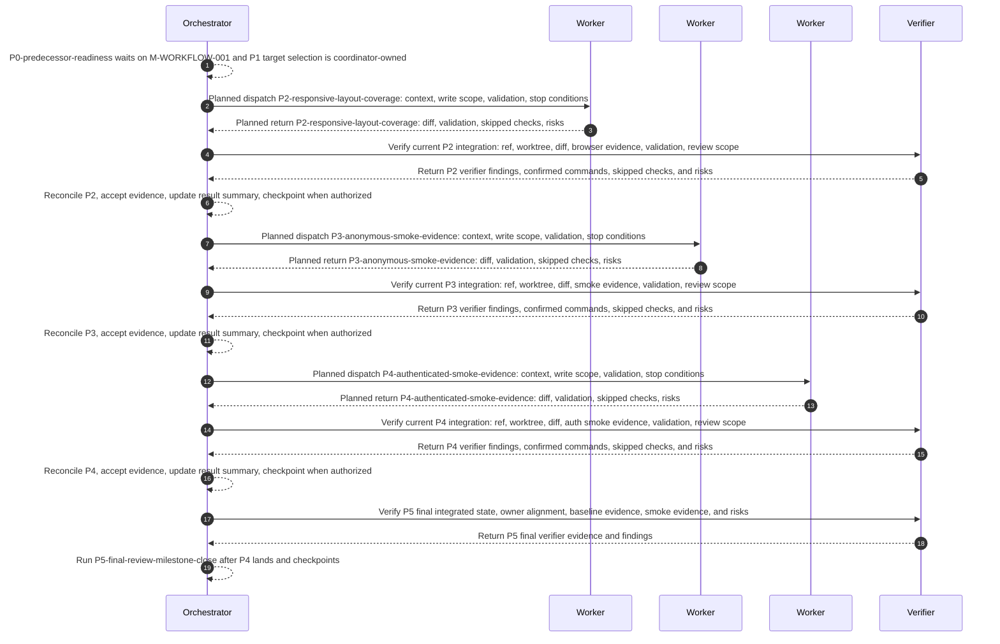

# Plan: Responsive Layout And Smoke Evidence

Plan-ID: PLAN-responsive-layout-smoke-evidence

Status: In Progress

Workers: 1 implementation lane

Verifier worker: one dedicated read-only clean verifier for P2-P5 evidence.

Filename: `.agents/plans/PLAN_responsive_layout_smoke_evidence.md`

## Readiness

- Plan readiness: In progress; `M-WORKFLOW-001` is complete and P0 confirmed predecessor readiness.
- Approved by:
- Approved at:
- Open questions: No blocking product questions identified from current owners.
- Implementation progress: P4-authenticated-smoke-evidence is `Complete`; P5-final-review-milestone-close is `Ready`.

Use this plan after `M-WORKFLOW-001` lands and the predecessor readiness packet confirms workflow layout, route context, table actions, and session controls are stable enough for responsive and smoke evidence work. Creating or updating this plan is not implementation approval.

## Status History

- 2026-06-07T23:06:58+02:00: none -> Draft by Codex; plan created for `M-SMOKE-001`.
- 2026-06-08T00:53:32+02:00: predecessor `M-WORKFLOW-001` completed by `PLAN-workflow-polish`; P0 promoted to `Ready`.
- 2026-06-08T01:04:56+02:00: Draft -> In Progress by Codex; P0 confirmed predecessor readiness and promoted P1 to `Ready`.
- 2026-06-08T01:08:20+02:00: verifier worker declared for P2-P5 review, validation, and final evidence.
- 2026-06-08T01:11:55+02:00: P1 selected responsive, anonymous smoke, and authenticated smoke targets; P2 promoted to `Ready`.
- 2026-06-08T01:34:21+02:00: P2 responsive layout coverage completed with source/tests, browser evidence, verifier review, and baseline validation; P3 promoted to `Ready`.
- 2026-06-08T01:41:23+02:00: P3 anonymous smoke evidence completed with command/docs updates, smoke pass, verifier review, and baseline validation; P4 promoted to `Ready`.
- 2026-06-08T01:47:37+02:00: P4 authenticated smoke evidence completed with command/docs updates, smoke pass, verifier review, and baseline validation; P5 promoted to `Ready`.

## Goal

Deliver `M-SMOKE-001: Responsive Layout And Smoke Evidence` by making post-workflow layouts deliberate across desktop and narrow viewports, preserving table, filter, action, navigation, and auth-control discoverability, and adding repeatable browser smoke evidence for selected anonymous and authenticated flows.

## Non-Goals

- Do not implement `M-WORKFLOW-001`; this plan waits for workflow polish to land.
- Do not implement blocked `M-QUALITY-001` accessibility automation, smoke-gap promotion thresholds, or hardening gates.
- Do not refresh or expand the backend API contract unless a contract conflict is discovered.
- Do not add endpoints, request fields, authentication flows, providers, role semantics, CORS behavior, JWT, bearer-token handling, alternate transports, or provider-specific OAuth paths.
- Do not require external OAuth credentials for canonical authenticated smoke.
- Do not make smoke evidence a release-blocking gate beyond the selected command or procedure evidence this milestone owns.
- Do not add a generic command wrapper, broad workflow-state directory, visual-diff platform, or reusable process scaffold unless the selected smoke or responsive evidence cannot be represented through existing commands, tests, docs, and scripts.

## Source Artifacts

- User request: `make a plan for M-SMOKE-001: Responsive Layout And Smoke Evidence`.
- Roadmap refs: `ROADMAP.md` release context, product direction, `M-SMOKE-001`, `E-RESP-001`, `E-SMOKE-002`, `E-SMOKE-001`, and dependency from `M-WORKFLOW-001`.
- Design/spec refs: `docs/DESIGN.md`; route specs under `docs/specs/` only when a changed route's responsive behavior is too broad or ambiguous for the roadmap and design guide.
- Smoke and local workflow refs: `docs/LOCAL_DEVELOPMENT.md`, `docs/LOCAL_AUTH_SMOKE.md`, `scripts/smoke-anonymous.mjs`, and `package.json`.
- Backend contract refs: `docs/backend/FRONTEND_AI_CONTRACT.md`, `docs/backend/README.md`; escalate to `docs/backend/approved-openapi.json` only for exact API conflicts.
- Focused references: `AGENTS.md`, `.agents/references/execution.md`, `.agents/references/planning.md`, `.agents/references/plan-execution.md`, `.agents/references/documentation.md`, `.agents/references/roadmap.md`, `.agents/references/testing.md`, `.agents/references/reviews.md`, `.agents/references/architecture.md`, and `.agents/references/code-style.md`.
- Source files or tests: `src/App.tsx`, `src/App.test.tsx`, `src/index.css`, `src/auth/RequireAuthenticated.tsx`, `src/catalog/`, `src/account/`, `src/admin/`, `src/operator/`, `src/ui/`, `src/api/session.ts`, `src/mock-api/`, and affected route/component/API tests.

Load only the artifacts needed for the current packet. Do not bulk-load generated contract files, source trees, archived plans, or roadmap archives unless a task packet names them or an escalation trigger fires.

## Assumptions

- `M-WORKFLOW-001` will leave route hierarchy, page-level workflow grouping, table actions, filter behavior, and session-control copy stable enough for responsive coverage and smoke selection.
- Existing route/component tests can protect most responsive behavior by asserting structure, controls, labels, and query state; browser review provides viewport evidence where CSS layout is the primary behavior.
- `npm run smoke:anonymous` is the existing anonymous smoke command and can be extended or documented without changing the browser boundary contract.
- `docs/LOCAL_AUTH_SMOKE.md` is the current authenticated smoke source of truth; canonical authenticated evidence should use the backend `local,oauth,fake-oauth` profile and the discovered `smoke` provider without external credentials.
- Authenticated smoke may remain a documented repeatable procedure if a fully automated command cannot be added without backend changes or unsafe provider-path assumptions.

## Open Questions

- None blocking plan approval. If implementation discovers that post-workflow route behavior is unclear, stop and move the decision to `docs/DESIGN.md`, `ROADMAP.md`, a focused spec, or the smoke owner document before continuing.

## Proposed Changes

- Link this active plan from `ROADMAP.md` without changing `M-SMOKE-001` status until its dependency is complete.
- Select a compact responsive and smoke target matrix after `M-WORKFLOW-001` lands, including viewport widths, routes, flows, backend profile expectations, and required skip reasons.
- Update responsive CSS and affected route components so navigation, auth controls, tables, filters, row actions, and pagination remain usable on narrow and desktop widths.
- Add or update route/component tests that protect selected responsive structures and unchanged backend-backed query, session, and action behavior.
- Extend anonymous browser smoke evidence for the selected anonymous shell and public catalog paths while keeping requests same-origin and `/api/**` shaped.
- Add or formalize authenticated smoke evidence for session bootstrap, authenticated route access, account access where selected, and CSRF-backed logout through the metadata-driven fake-OAuth path.
- Update smoke docs and scripts so evidence records the frontend URL, backend profile, flow covered, validation date, route coverage, and skipped authenticated steps with reasons.
- Update this plan's result summaries during implementation. Update `ROADMAP.md` status only when the milestone actually completes and the request authorizes roadmap status changes.

## Contract And Repository Invariants

- Route API-facing behavior through `docs/backend/` and the imported backend contract artifacts before implementation.
- Browser traffic remains same-origin `/api/**` with session-cookie auth.
- Bootstrap auth state with `GET /api/session`.
- Render login options from `loginProviders[]`; do not hard-code provider paths.
- Use session metadata for `accountPath`, `logoutPath`, CSRF cookie name, and CSRF header name.
- For unsafe writes with a real current session, mirror the readable CSRF cookie into the configured CSRF request header.
- Treat localized messages as display content and branch on stable fields such as status, `messageKey`, and endpoint context.
- Preserve Spring `page`, `size`, repeated `sort`, repeated filters, and book `version` update behavior.
- Keep smoke automation and docs from navigating directly to backend fake-provider support endpoints.
- Keep smoke evidence explicit about skipped prerequisites; do not record a prerequisite skip as a pass.
- Do not hand-edit `src/api/generated/openapi.ts`.
- Move durable rules discovered during execution into the owning backend contract artifact, executable test, human doc, design guide, roadmap row, focused reference, or source file before this plan is complete.
- Run `git status --short` before edits and treat existing or unexpected changes as user-owned.
- Assign explicit write scopes to workers and keep unrelated user or parallel-worker changes intact.
- Commit only when the current request and plan checkpoint authorize it, and keep unrelated files out of the checkpoint commit.

## Clean Verifier

- Declared verifier: one dedicated read-only clean verifier for this plan execution.
- Scope: P2-P4 integrated diff review, responsive/browser evidence review, smoke evidence review, validation confirmation, and P5 final owner-drift and milestone-close evidence.
- Context: start without full thread history or forked conversation context; send compact prompts with the current ref or commit, worktree state, diff scope, commands, review scope, stop conditions, and output format.
- Write scope: read-only; the coordinator records compact verifier summaries in this plan and owns any roadmap or owner-document edits.
- Stale-state guard: before each review or validation pass, the verifier must confirm the current worktree state, ref or commit, and diff it can see. Do not use verifier evidence when it cannot see the current integrated state.
- Coordinator authority: the coordinator owns dispatch, dirty-worktree protection, shared-file sequencing, resolving verifier findings, integration acceptance, plan/status/roadmap edits, checkpoint commits, and final handoff.

## Progress Tracker

| Packet                          | Status   | Owner       | Depends On       | Last Updated | Notes                                                             |
| ------------------------------- | -------- | ----------- | ---------------- | ------------ | ----------------------------------------------------------------- |
| P0-predecessor-readiness        | Complete | Coordinator | `M-WORKFLOW-001` | 2026-06-08   | Confirmed workflow polish is complete before execution            |
| P1-evidence-target-selection    | Complete | Coordinator | P0               | 2026-06-08   | Selected viewport, route, anonymous smoke, and auth smoke targets |
| P2-responsive-layout-coverage   | Complete | Worker      | P1               | 2026-06-08   | Covers `E-RESP-001`                                               |
| P3-anonymous-smoke-evidence     | Complete | Worker      | P2               | 2026-06-08   | Covers `E-SMOKE-002`                                              |
| P4-authenticated-smoke-evidence | Complete | Worker      | P3               | 2026-06-08   | Covers `E-SMOKE-001`                                              |
| P5-final-review-milestone-close | Ready    | Coordinator | P4               | 2026-06-08   | Confirm validation, smoke evidence, owner drift, and closeout     |

Use `Waiting` for these packets until `M-WORKFLOW-001` is complete and predecessor readiness has been recorded. Do not promote downstream packets to `Ready` until their predecessor lands, validates, and any required checkpoint is complete.

## Task Packets

Use inline packets for this sequential plan. Repository-changing implementation packets require a fresh implementation worker subagent when the active tool contract allows worker delegation. Coordinator-owned packets may update this plan and roadmap status only within the write scope named below.

### Task Packet: P0-predecessor-readiness

Task id: P0-predecessor-readiness

Lane: exploration

Goal:

- Confirm `M-WORKFLOW-001` has landed and leaves stable workflow layout, route context, table actions, filter behavior, and account/session controls for responsive and smoke evidence work.

Initial context budget:

- Read first:
  - Plan header, `## Readiness`, `## Progress Tracker`, `## Execution Model`, this task packet, and this packet's `Result summary`.
  - `AGENTS.md`, `ROADMAP.md`, `docs/DESIGN.md`, `.agents/plans/PLAN_workflow_polish.md`, `.agents/references/roadmap.md`, `.agents/references/planning.md`, `.agents/references/plan-execution.md`, `.agents/references/testing.md`, and `.agents/references/reviews.md`.
- Escalate to:
  - Implemented `M-WORKFLOW-001` diffs, affected route tests, affected route source, `docs/specs/`, and backend contract artifacts only when readiness cannot be decided from roadmap, plan summaries, and completed diffs.

Write scope:

- `.agents/plans/PLAN_responsive_layout_smoke_evidence.md`.
- `ROADMAP.md` only if roadmap status or plan references need updating.

Dependencies:

- `M-WORKFLOW-001` completion.

Validation:

- `npm run lint:markdown`.
- `git diff --check`.
- No commit is authorized unless the current request or an approved checkpoint asks for one.

Escalation triggers:

- `M-WORKFLOW-001` changes route ownership, table behavior, account/session controls, smoke prerequisites, or planned responsive scope enough that packet ownership is stale.
- Roadmap status conflicts with actual completed work.
- The current route set no longer matches the route families named by this plan.

Stop conditions:

- `M-WORKFLOW-001` is still waiting, in progress, or incomplete.
- Readiness requires product, design, smoke, or roadmap decisions not present in owner docs.
- Dirty changes appear inside the assigned write scope before editing.

Expected output:

- Plan readiness/status update or replan note.
- Validation evidence from `.agents/references/testing.md`.
- Self-review evidence from `.agents/references/reviews.md`.
- Coordinator reconciliation.
- Blockers, review risks, and next action.

Result summary:

- Status: complete
- Worker: Coordinator-owned; no implementation worker required.
- Changed files or reviewed diff: Reviewed `ROADMAP.md` `M-WORKFLOW-001` and `M-SMOKE-001`, `docs/DESIGN.md` responsive and smoke direction, `PLAN-workflow-polish` current worktree state, and completed closeout commit `3e13dc7`; updated this plan's readiness, progress tracker, P0 summary, execution ledger, and continuity notes.
- Validation evidence from `.agents/references/testing.md`: Passed `npm run lint:markdown`; passed `git diff --check`.
- Self-review evidence from `.agents/references/reviews.md`: Checked documentation drift across roadmap, design, and active-plan owners; no backend contract, source, auth, CSRF, session, or smoke behavior changed.
- Commit: No commit requested or created.
- Coordinator reconciliation: `M-WORKFLOW-001` is `done` in `ROADMAP.md`, `M-SMOKE-001` is `ready`, and P1 can select responsive and smoke targets.
- Changelog/docs/spec/roadmap updates: No `ROADMAP.md`, changelog, spec, or owner-doc update needed.
- Blockers: None for P1 target selection.
- Review risks: `.agents/plans/PLAN_workflow_polish.md` has a pre-existing unresolved conflict outside this plan's write scope; use `ROADMAP.md` and commit `3e13dc7` as the compact predecessor evidence until that conflict is resolved.
- Handoff notes and next action: Run P1-evidence-target-selection next; keep P2 through P5 waiting until P1 records selected targets and validation evidence.

### Task Packet: P1-evidence-target-selection

Task id: P1-evidence-target-selection

Lane: exploration

Goal:

- Select the responsive viewport matrix, route coverage, anonymous smoke flow, authenticated smoke flow, backend profile expectations, and accepted skip reasons for the rest of this plan.

Initial context budget:

- Read first:
  - Plan header, `## Readiness`, `## Progress Tracker`, `## Execution Model`, this task packet, and this packet's `Result summary`.
  - `AGENTS.md`, `ROADMAP.md` rows for `M-SMOKE-001`, `docs/DESIGN.md`, `.agents/references/testing.md`, `.agents/references/reviews.md`, `docs/LOCAL_DEVELOPMENT.md`, `docs/LOCAL_AUTH_SMOKE.md`, `scripts/smoke-anonymous.mjs`, and post-`M-WORKFLOW-001` route tests.
- Escalate to:
  - `src/App.tsx`, `src/index.css`, affected route components, affected route specs, `vite.config.ts`, `src/mock-api/`, and backend contract artifacts only when target selection reveals ambiguity or a route/smoke contract conflict.

Write scope:

- `.agents/plans/PLAN_responsive_layout_smoke_evidence.md`.
- `docs/DESIGN.md`, `ROADMAP.md`, `docs/specs/`, `docs/LOCAL_DEVELOPMENT.md`, or `docs/LOCAL_AUTH_SMOKE.md` only if a durable decision is required before implementation can proceed.

Dependencies:

- P0-predecessor-readiness.

Validation:

- `npm run lint:markdown`.
- `git diff --check`.
- No commit is authorized unless the current request or an approved checkpoint asks for one.

Escalation triggers:

- The selected route list would omit a roadmap acceptance criterion.
- Existing docs disagree about anonymous or authenticated smoke ownership.
- The authenticated smoke procedure needs a backend profile, credential, or local data state not owned by current docs.
- Responsive behavior is too broad for `ROADMAP.md` plus `docs/DESIGN.md` and needs a focused spec.

Stop conditions:

- Selected smoke evidence cannot name the frontend URL, route coverage, backend profile, flow covered, and skip/fail behavior.
- A target would require backend changes, provider secrets, direct backend-origin browser traffic, CORS assumptions, bearer tokens, JWTs, or hard-coded provider paths.
- Dirty changes appear inside the assigned write scope before editing.

Expected output:

- Updated target matrix in this plan or a durable owner document.
- Explicit selected routes and viewport widths for responsive review.
- Explicit anonymous and authenticated smoke coverage and skip reasons.
- Validation evidence from `.agents/references/testing.md`.
- Self-review evidence from `.agents/references/reviews.md`.
- Coordinator reconciliation and next packet readiness.

Result summary:

- Status: complete
- Worker: Coordinator-owned; no implementation worker required.
- Changed files or reviewed diff: Reviewed `ROADMAP.md` `M-SMOKE-001`, `docs/DESIGN.md`, `docs/LOCAL_DEVELOPMENT.md`, `docs/LOCAL_AUTH_SMOKE.md`, `scripts/smoke-anonymous.mjs`, `scripts/smoke-authenticated-mock.mjs`, `package.json`, `src/App.tsx`, `src/App.test.tsx`, `src/index.css`, and affected route/component tests; updated this plan's readiness, status history, progress tracker, P1 summary, execution graph, and continuity notes.
- Selected responsive targets: Browser review widths are desktop `1280x900` and narrow `375x812`; selected routes are anonymous `/catalog`, authenticated `/account`, authenticated `/admin/catalog`, authenticated `/admin/users`, and authenticated `/operator` in mock admin mode. The route set covers primary navigation, auth controls, public filters and pagination, admin book filters and row actions, admin user row actions and detail state, and operator filters, pagination, and details.
- Selected anonymous smoke targets: `npm run smoke:anonymous` remains the canonical live-backend command against default frontend URL `http://127.0.0.1:5173/`; it covers shell bootstrap, `/catalog` URL-backed filters, public categories/books, repeated `category` and `sort`, localized public-read failure fields, and same-origin `/api/**` request observation. Backend expectation is a sibling backend reachable through the frontend proxy; `SPRING_PROFILES_ACTIVE=local` is sufficient and OAuth is not required.
- Selected authenticated smoke targets: `npm run smoke:authenticated` is the canonical automated authenticated command against the internal contract-backed mock API; it covers anonymous bootstrap, metadata-driven login provider link, authenticated session metadata, `/account`, `/admin/users`, CSRF-backed logout, post-logout account protection, and same-origin `/api/**` request observation. Live sibling-backend fake-OAuth remains the documented manual procedure in `docs/LOCAL_AUTH_SMOKE.md` with profile `local,oauth,fake-oauth` and `smoke` provider discovery.
- Validation evidence from `.agents/references/testing.md`: Passed `npm run lint:markdown`; passed `git diff --check`.
- Self-review evidence from `.agents/references/reviews.md`: Checked roadmap/design/local-smoke owner alignment; no backend contract, source, package, auth, CSRF, routing, or smoke behavior changed.
- Commit: No commit created; P1 has no implementation checkpoint.
- Coordinator reconciliation: `M-SMOKE-001` remains `ready` in `ROADMAP.md`; selected targets satisfy `E-RESP-001`, `E-SMOKE-002`, and `E-SMOKE-001` without requiring backend changes, provider secrets, CORS, bearer tokens, JWTs, or hard-coded provider paths.
- Changelog/docs/spec/roadmap updates: No durable owner change required; target selection is plan coordination only.
- Blockers: None for P2.
- Review risks: Anonymous live smoke depends on frontend, backend, and Playwright prerequisites; authenticated live-backend fake-OAuth remains manual and can be skipped only with documented environment reasons.
- Handoff notes and next action: Run P2-responsive-layout-coverage with the selected viewport and route matrix; keep P3 and P4 waiting until P2 implementation, validation, verifier evidence, and checkpoint complete.

### Task Packet: P2-responsive-layout-coverage

Task id: P2-responsive-layout-coverage

Lane: implementation

Goal:

- Make selected post-workflow layouts deliberate across narrow and desktop viewports, keeping navigation, auth controls, table state, filters, row actions, pagination, and primary actions coherent and discoverable.

Initial context budget:

- Read first:
  - Plan header, `## Readiness`, `## Progress Tracker`, `## Execution Model`, this task packet, and this packet's `Result summary`.
  - `AGENTS.md`, `ROADMAP.md` `E-RESP-001`, `docs/DESIGN.md`, `.agents/references/architecture.md`, `.agents/references/code-style.md`, `.agents/references/testing.md`, `.agents/references/reviews.md`, `src/App.tsx`, `src/App.test.tsx`, `src/index.css`, affected route components, and affected route/component tests.
- Escalate to:
  - `docs/specs/`, `src/ui/`, `src/api/`, `docs/backend/`, `docs/LOCAL_DEVELOPMENT.md`, and browser review evidence only when the selected responsive target requires them.

Write scope:

- `src/App.tsx`.
- `src/App.test.tsx`.
- `src/index.css`.
- Affected route components and tests in `src/catalog/`, `src/account/`, `src/admin/`, and `src/operator/`.
- Small shared UI files under `src/ui/` only if at least two selected routes need the same responsive/state helper.
- `.agents/plans/PLAN_responsive_layout_smoke_evidence.md` result summary.

Dependencies:

- P1-evidence-target-selection.

Validation:

- Targeted route/component tests during implementation when useful.
- Browser responsive review through the in-app Browser or Playwright against `npm run dev:mock` or the selected live frontend URL for the selected desktop and narrow widths.
- `npm run lint`.
- `npm run typecheck`.
- `npm test`.
- `npm run build`.
- `git diff --check`.
- Commit checkpoint is authorized only after validation when the current request approves active-plan commits.

Escalation triggers:

- Responsive behavior needs a route-specific product decision not owned by `docs/DESIGN.md`, `ROADMAP.md`, or existing specs.
- A layout change requires altering query-state, session, auth, CSRF, localization, API, generated type, or route-guard behavior.
- Browser review reveals overlap, clipped text, hidden primary actions, or unavailable table actions that tests do not cover.

Stop conditions:

- Implementation would hide selected primary actions, rely on viewport-scaled fonts, or branch on localized English display text.
- Work requires changing backend API behavior, generated types, auth provider assumptions, or smoke procedure ownership.
- Dirty changes appear inside assigned write scope before editing.
- Changes outside the assigned write scope are needed and cannot be split into a separate packet or replan.

Expected output:

- Changed responsive layout files and tests.
- Browser viewport evidence summary with URL, widths, routes, and notable findings.
- Validation evidence from `.agents/references/testing.md`.
- Self-review evidence from `.agents/references/reviews.md`.
- Clean verifier evidence.
- Commit identifier when a commit checkpoint is authorized and completed.
- Coordinator reconciliation, blockers, review risks, and next action.

Result summary:

- Status: complete
- Worker: Worker 1 implementation lane; coordinator applied the verifier-requested row-action `role="group"` fix.
- Changed files or reviewed diff: Updated responsive CSS in `src/index.css`; added named focusable table scroll regions and filter/action labels in `src/catalog/CatalogPanel.tsx`, `src/admin/AdminCatalogPage.tsx`, `src/admin/AdminUsersPage.tsx`, and `src/operator/OperatorPage.tsx`; added focused responsive structure/control tests in `src/catalog/CatalogPanel.test.tsx`, `src/account/AccountProfile.test.tsx`, `src/admin/AdminCatalogPage.test.tsx`, `src/admin/AdminUsersPage.test.tsx`, and `src/operator/OperatorPage.test.tsx`.
- Browser responsive evidence: Worker reviewed `http://127.0.0.1:5177/` via `npm run dev:mock`; verifier reviewed `http://127.0.0.1:5173/` via `npm run dev:mock`; both used widths `1280x900` and `375x812` across `/catalog`, `/account`, `/admin/catalog`, `/admin/users`, and `/operator`. Evidence found nav/auth/filter/pagination/action/detail controls present, no page-level horizontal overflow, and wide tables contained inside named focusable scroll regions.
- Validation evidence from `.agents/references/testing.md`: Passed `npm test -- src/catalog/CatalogPanel.test.tsx src/account/AccountProfile.test.tsx src/admin/AdminCatalogPage.test.tsx src/admin/AdminUsersPage.test.tsx src/operator/OperatorPage.test.tsx` with 49 tests; passed `npm test -- src/admin/AdminCatalogPage.test.tsx src/admin/AdminUsersPage.test.tsx` after verifier fix with 25 tests; passed `npm run lint`; passed `npm run typecheck`; passed `npm test` with 154 tests; passed `npm run build`; passed `git diff --check`.
- Self-review evidence from `.agents/references/reviews.md`: Reviewed for responsive overlap, clipped controls, table action discoverability, route/component test coverage, query-state drift, auth/session/CSRF/provider-path drift, and package/script/backend-contract scope leaks. No generated types, backend contract files, package scripts, smoke scripts, or docs changed for P2.
- Clean verifier evidence: Verifier reviewed current ref `954f82f`, ran targeted tests, lint, typecheck, full tests, build, `git diff --check`, and browser responsive review; initial finding requested semantic row-action groups, which coordinator fixed; verifier follow-up reported no findings and confirmed `.agents/references/execution.md` was not dirty.
- Commit: `ece753a` (`feat(responsive): preserve workflow controls across viewports`).
- Coordinator reconciliation: `E-RESP-001` responsive acceptance is covered for the selected matrix; P3 can start after the P2 checkpoint commit is created.
- Changelog/docs/spec/roadmap updates: No `ROADMAP.md`, changelog, spec, backend, or durable design-doc update needed; implementation follows existing design direction.
- Blockers: None for P3.
- Review risks: Browser review was DOM/metric based rather than visual diff; table row actions on narrow widths intentionally remain inside horizontal table scroll regions.
- Handoff notes and next action: Create the P2 checkpoint commit, then run P3-anonymous-smoke-evidence.

### Task Packet: P3-anonymous-smoke-evidence

Task id: P3-anonymous-smoke-evidence

Lane: implementation

Goal:

- Add or refine repeatable anonymous browser smoke evidence for the selected anonymous shell and public catalog paths while keeping all smoke traffic same-origin and `/api/**` shaped.

Initial context budget:

- Read first:
  - Plan header, `## Readiness`, `## Progress Tracker`, `## Execution Model`, this task packet, and this packet's `Result summary`.
  - `AGENTS.md`, `ROADMAP.md` `E-SMOKE-002`, `docs/DESIGN.md`, `docs/LOCAL_DEVELOPMENT.md`, `scripts/smoke-anonymous.mjs`, `package.json`, `vite.config.ts`, `src/App.tsx`, `src/catalog/`, `src/routing/`, and affected tests.
- Escalate to:
  - `src/mock-api/`, `docs/backend/`, `docs/LOCAL_AUTH_SMOKE.md`, package lockfile, and Playwright documentation already available through installed dependencies only when script or command behavior requires them.

Write scope:

- `scripts/smoke-anonymous.mjs`.
- `docs/LOCAL_DEVELOPMENT.md`.
- `docs/LOCAL_AUTH_SMOKE.md` only for cross-reference alignment.
- `package.json` and `package-lock.json` only if command names or dependencies change.
- Affected smoke, mock API, route, or routing tests only if the anonymous smoke change exposes a frontend-owned gap.
- `.agents/plans/PLAN_responsive_layout_smoke_evidence.md` result summary.

Dependencies:

- P2-responsive-layout-coverage.

Validation:

- `npm run smoke:anonymous`; record pass, fail, or prerequisite skip summary with frontend URL and route coverage.
- `npm run lint`.
- `npm run typecheck`.
- `npm test`.
- `npm run build`.
- `git diff --check`.
- Commit checkpoint is authorized only after validation when the current request approves active-plan commits.

Escalation triggers:

- The selected anonymous route needs backend contract detail beyond existing smoke assertions.
- The smoke command cannot tell pass from prerequisite skip.
- Adding route coverage would require changing app routing, query serialization, mock API behavior, or package scripts outside the named write scope.

Stop conditions:

- Smoke implementation would point the browser directly at the backend origin, add CORS assumptions, branch on localized English response text, or invent request fields.
- The command cannot record frontend URL, route coverage, backend availability state, and skip/fail reasons.
- Dirty changes appear inside assigned write scope before editing.

Expected output:

- Anonymous smoke command or procedure changes.
- Smoke evidence summary with frontend URL, selected routes, backend profile or availability, flow covered, validation date, and skipped steps.
- Validation evidence from `.agents/references/testing.md`.
- Self-review evidence from `.agents/references/reviews.md`.
- Clean verifier evidence.
- Commit identifier when a commit checkpoint is authorized and completed.
- Coordinator reconciliation, blockers, review risks, and next action.

Result summary:

- Status: complete
- Worker: Worker 2 implementation lane.
- Changed files or reviewed diff: Updated `scripts/smoke-anonymous.mjs` evidence output and prerequisite skip semantics; updated `docs/LOCAL_DEVELOPMENT.md` browser smoke workflow and `docs/LOCAL_AUTH_SMOKE.md` automation policy wording to match the command behavior.
- Anonymous smoke evidence: `npm run smoke:anonymous` passed against `http://127.0.0.1:5173/`; command printed validation date `2026-06-07T23:39:36.758Z`, backend expectation `sibling backend reachable through the frontend /api proxy; SPRING_PROFILES_ACTIVE=local is sufficient and OAuth is not required`, route coverage `/` shell probe and `/catalog` with title/author/ISBN, repeated `category`, page/size, and repeated `sort`; summary was `PASSED (7 passed, 0 skipped, 0 failed)`.
- Validation evidence from `.agents/references/testing.md`: Passed `npm run smoke:anonymous`; passed `npm run lint`; passed `npm run typecheck`; passed `npm test` with 154 tests; passed `npm run build`; passed `git diff --check`.
- Self-review evidence from `.agents/references/reviews.md`: Reviewed same-origin `/api/**` traffic, frontend-origin browser navigation, stable localized failure assertions, explicit prerequisite skip semantics, docs alignment, and package/backend/generated-type scope. No CORS, JWT, bearer-token, direct backend-origin browser navigation, provider-path, or localized English branching was added.
- Clean verifier evidence: Verifier reviewed current ref `ece753a`, confirmed expected dirty files only, ran `npm run smoke:anonymous`, `npm run lint`, `npm run typecheck`, `npm test`, `npm run build`, and `git diff --check`; no findings. Verifier smoke evidence printed validation date `2026-06-07T23:40:31.780Z` and passed with 7 passed, 0 skipped, 0 failed.
- Commit: `b5fbb81` (`test(smoke): record anonymous browser evidence`).
- Coordinator reconciliation: `E-SMOKE-002` anonymous smoke acceptance is covered for the selected flow; P4 can start after the P3 checkpoint commit is created.
- Changelog/docs/spec/roadmap updates: No `ROADMAP.md`, changelog, spec, backend, generated type, or package-script update needed.
- Blockers: None for P4.
- Review risks: Smoke pass depends on local frontend/backend availability at `127.0.0.1:5173`; command reports backend profile as an expectation rather than introspecting the backend process.
- Handoff notes and next action: Create the P3 checkpoint commit, then run P4-authenticated-smoke-evidence.

### Task Packet: P4-authenticated-smoke-evidence

Task id: P4-authenticated-smoke-evidence

Lane: implementation

Goal:

- Add or formalize repeatable authenticated smoke evidence for session bootstrap, metadata-driven fake-OAuth login, authenticated route or account access, and CSRF-backed logout.

Initial context budget:

- Read first:
  - Plan header, `## Readiness`, `## Progress Tracker`, `## Execution Model`, this task packet, and this packet's `Result summary`.
  - `AGENTS.md`, `ROADMAP.md` `E-SMOKE-001`, `docs/DESIGN.md`, `docs/LOCAL_DEVELOPMENT.md`, `docs/LOCAL_AUTH_SMOKE.md`, `scripts/smoke-anonymous.mjs`, `package.json`, `src/api/session.ts`, `src/App.tsx`, `src/auth/RequireAuthenticated.tsx`, and affected session/auth tests.
- Escalate to:
  - `docs/backend/`, sibling-backend docs only through `docs/backend/README.md` routing, `vite.config.ts`, `src/mock-api/`, and package lockfile only when exact authenticated smoke behavior cannot be decided from current owner docs.

Write scope:

- `docs/LOCAL_AUTH_SMOKE.md`.
- `docs/LOCAL_DEVELOPMENT.md`.
- `scripts/smoke-authenticated.mjs` if a canonical automated command is viable.
- `package.json` and `package-lock.json` only if an authenticated smoke command is added.
- Affected smoke, mock API, session, or auth tests only if the authenticated smoke change exposes a frontend-owned gap.
- `.agents/plans/PLAN_responsive_layout_smoke_evidence.md` result summary.

Dependencies:

- P3-anonymous-smoke-evidence.

Validation:

- Run the selected authenticated smoke command if added; otherwise perform or document the repeatable manual procedure from `docs/LOCAL_AUTH_SMOKE.md`.
- Record frontend URL, backend profile, selected flow, validation date, and skipped authenticated steps with reasons.
- `npm run lint` if scripts, package files, source, or mixed docs changed; `npm run lint:markdown` is sufficient only for docs-only procedure changes.
- `npm run typecheck` if package scripts, source, or smoke JavaScript changes could affect executable behavior.
- `npm test` if source, mocks, session helpers, or smoke-testable behavior changes.
- `npm run build` if source, package scripts, or executable smoke files change.
- `git diff --check`.
- Commit checkpoint is authorized only after validation when the current request approves active-plan commits.

Escalation triggers:

- Fake-OAuth smoke cannot start from discovered `loginProviders[].authorizationPath`.
- Authenticated smoke needs external credentials, committed secrets, provider tokens, direct backend-origin browser traffic, or hard-coded provider paths.
- The backend fake-OAuth profile, first-admin seed behavior, account path, logout path, or CSRF metadata conflict with imported frontend owner docs.
- A UI auth-control gap requires app source changes outside this packet's smoke-owned write scope.

Stop conditions:

- The smoke path cannot remain metadata-driven from `GET /api/session`.
- Unsafe authenticated logout cannot mirror the readable CSRF cookie into the configured CSRF header.
- The proposed smoke evidence cannot distinguish failures from environment skips.
- Dirty changes appear inside assigned write scope before editing.

Expected output:

- Authenticated smoke command or procedure changes.
- Authenticated evidence summary with frontend URL, backend profile, flow covered, validation date, and skipped steps.
- Validation evidence from `.agents/references/testing.md`.
- Self-review evidence from `.agents/references/reviews.md`.
- Clean verifier evidence.
- Commit identifier when a commit checkpoint is authorized and completed.
- Coordinator reconciliation, blockers, review risks, and next action.

Result summary:

- Status: complete
- Worker: Worker 3 implementation lane.
- Changed files or reviewed diff: Updated `scripts/smoke-authenticated-mock.mjs` evidence output, prerequisite skip semantics, post-logout pass records, and skipped-step summary; updated `docs/LOCAL_DEVELOPMENT.md` and `docs/LOCAL_AUTH_SMOKE.md` authenticated smoke wording.
- Authenticated smoke evidence: `npm run smoke:authenticated` passed; command printed validation date `2026-06-07T23:46:16.552Z`, frontend URL `http://127.0.0.1:5174/`, backend profile `internal contract-backed mock API`, selected flow `contract-backed mock authenticated browser flow from anonymous session to mock admin session and logout`, route coverage `/catalog`, `/account`, `/admin/users`, and post-logout `/account` guard; summary was `PASSED (10 passed, 0 skipped, 0 failed)` and `Skipped authenticated steps: none`.
- Validation evidence from `.agents/references/testing.md`: Passed `npm run smoke:authenticated`; passed `npm run lint`; passed `npm run typecheck`; passed `npm test` with 154 tests; passed `npm run build`; passed `git diff --check`.
- Self-review evidence from `.agents/references/reviews.md`: Reviewed metadata-driven login/account/logout/CSRF behavior, same-origin `/api/**` observation, skip semantics, docs alignment, and security triggers. No external-provider automation, secrets, direct backend-origin traffic, CORS, JWT, bearer token, hard-coded provider path, generated type, backend contract, or package script change was added.
- Clean verifier evidence: Verifier reviewed current ref `b5fbb81`, confirmed expected dirty files only, ran `npm run smoke:authenticated`, `npm run lint`, `npm run typecheck`, `npm test`, `npm run build`, and `git diff --check`; no findings. Verifier smoke evidence printed validation date `2026-06-07T23:46:54.360Z`, passed with 10 passed, 0 skipped, 0 failed, and reported `Skipped authenticated steps: none`.
- Commit: Pending P4 checkpoint commit.
- Coordinator reconciliation: `E-SMOKE-001` authenticated smoke acceptance is covered by the canonical mock command; live sibling-backend fake-OAuth remains documented manual evidence, not automated in this plan.
- Changelog/docs/spec/roadmap updates: No `ROADMAP.md`, changelog, spec, backend, generated type, or package-script update needed.
- Blockers: None for P5.
- Review risks: P4 validates the internal mock authenticated path; live sibling-backend fake-OAuth remains governed by `docs/LOCAL_AUTH_SMOKE.md` and was not run.
- Handoff notes and next action: Create the P4 checkpoint commit, then run P5-final-review-milestone-close.

### Task Packet: P5-final-review-milestone-close

Task id: P5-final-review-milestone-close

Lane: review

Goal:

- Reconcile responsive layout, anonymous smoke, authenticated smoke, validation, owner drift, and roadmap state before closing the milestone or handing off remaining risks.

Initial context budget:

- Read first:
  - Plan header, `## Readiness`, `## Progress Tracker`, `## Execution Model`, this task packet, all packet result summaries, and `## Long-Run Continuity`.
  - `AGENTS.md`, `ROADMAP.md` `M-SMOKE-001`, `docs/DESIGN.md`, `docs/LOCAL_DEVELOPMENT.md`, `docs/LOCAL_AUTH_SMOKE.md`, `.agents/references/documentation.md`, `.agents/references/roadmap.md`, `.agents/references/testing.md`, `.agents/references/reviews.md`, and final diffs for P2 through P4.
- Escalate to:
  - Affected route specs, backend contract artifacts, source files, smoke scripts, and validation logs only when final reconciliation reveals a gap or contradiction.

Write scope:

- `.agents/plans/PLAN_responsive_layout_smoke_evidence.md`.
- `ROADMAP.md` only if milestone or epic status changes are authorized by the current request and supported by completed evidence.
- `docs/LOCAL_DEVELOPMENT.md`, `docs/LOCAL_AUTH_SMOKE.md`, or `docs/DESIGN.md` only if final review finds durable owner drift that must be corrected before closeout.

Dependencies:

- P4-authenticated-smoke-evidence.

Validation:

- `npm run lint`.
- `npm run typecheck`.
- `npm test`.
- `npm run build`.
- `npm run smoke:anonymous`.
- Authenticated smoke command or manual procedure selected by P4, with skips recorded explicitly.
- `git diff --check`.
- No closeout commit is authorized unless the current request and plan checkpoint authorize it.

Escalation triggers:

- Route/component validation passes but browser viewport evidence shows overlap, clipped controls, or hidden primary actions.
- Smoke evidence cannot be matched to route coverage, frontend URL, backend profile, flow, validation date, or skipped steps.
- Durable rules remain only in this plan.
- Roadmap, design, local smoke docs, and implementation disagree.

Stop conditions:

- Any planned acceptance criterion remains unimplemented without an owner and follow-up.
- Final validation cannot distinguish environment unavailability from product failure.
- Closing the milestone would require changing selected scope, release state, blocked backlog, or product non-goals outside the authorized write scope.
- Dirty changes appear inside assigned write scope before editing.

Expected output:

- Final plan result summaries and milestone closeout note.
- Validation and smoke evidence summaries.
- Documentation, roadmap, and owner drift review.
- Commit identifiers when checkpoint commits are authorized and completed.
- Remaining risks and next action.

Result summary:

- Status: pending
- Worker:
- Changed files or reviewed diff:
- Final validation evidence:
- Final smoke evidence:
- Self-review evidence from `.agents/references/reviews.md`:
- Clean verifier evidence:
- Commit:
- Coordinator reconciliation:
- Changelog/docs/spec/roadmap updates:
- Blockers:
- Review risks:
- Handoff notes and next action:

## Execution Model

- `Workers: 1 implementation lane`; this is a sequential plan with one dedicated read-only verifier worker.
- Active-plan implementation uses a coordinator plus one fresh implementation worker subagent per repository-changing task packet and a separate clean verifier worker for P2-P5 evidence.
- Coordinator-owned exploration and review packets may update this plan and authorized status documents directly.
- If required implementation worker subagents or the declared clean verifier are unavailable, unauthorized by the active tool contract, or explicitly forbidden, stop before implementation or verification and report the blocker instead of running that task locally.
- Dispatch only the plan header or readiness summary, execution graph, assigned task packet, and explicitly named governing artifacts or source files. Do not dispatch the full approved plan by default.
- Before write delegation, check current worktree state, reserve explicit write scopes, and keep unrelated user or parallel-worker changes intact.
- Each repository-changing implementation packet must be implemented, validated through `.agents/references/testing.md`, self-reviewed through `.agents/references/reviews.md`, reviewed or validated by the clean verifier, and committed when the plan checkpoint and current request authorize a commit before the next dependent packet starts.
- Before starting the next dependent task, confirm every predecessor result summary records implementation status, validation evidence, self-review evidence, clean verifier evidence, and any required commit identifier.
- Keep compact evidence in the plan. Do not paste raw test output, raw worker transcripts, browser logs, screenshots, or bulky run logs.

## Long-Run Continuity

Use this checkpoint before starting each dependent task, before a pause or handoff, and after any context transition.

- Resume docs reread:
  - After context compaction, interruption, resume, or handoff, reread the latest user request, `AGENTS.md`, this plan's header, `## Readiness`, `## Long-Run Continuity`, `## Execution Model`, the current task packet and result summary, `.agents/references/plan-execution.md`, `.agents/references/testing.md`, `.agents/references/reviews.md`, and the next action's exact owner docs or source files.
- Current task or wave: P5-final-review-milestone-close is ready after P4 completed authenticated smoke evidence.
- Completed commits: `ece753a` for P2-responsive-layout-coverage; `b5fbb81` for P3-anonymous-smoke-evidence; P4 checkpoint pending creation.
- Plan status and readiness: In Progress; P0 through P4 complete and P5 ready.
- Validation and self-review state: P4 passed `npm run smoke:authenticated`, `npm run lint`, `npm run typecheck`, `npm test`, `npm run build`, `git diff --check`, and clean verifier review.
- Coordinator reconciliation state: P4 reconciliation complete; P5 final review is next after the P4 checkpoint commit.
- Changelog, docs, spec, roadmap, or plan updates: this plan is the active coordination artifact; `ROADMAP.md` links to `PLAN-responsive-layout-smoke-evidence`; no roadmap edit was needed for P0 through P4.
- Blockers or open questions: no blocking product questions.
- Next action: create the P4 checkpoint commit, then run P5-final-review-milestone-close.
- Context handoff notes: keep authenticated smoke metadata-driven from `GET /api/session`; do not promote smoke gaps to quality gates without `M-QUALITY-001` owner decisions.

## Execution Graph

| Packet                          | State    | Dispatch                         | Return | Orchestrator closeout                            | Checkpoint / next action                  |
| ------------------------------- | -------- | -------------------------------- | ------ | ------------------------------------------------ | ----------------------------------------- |
| P0-predecessor-readiness        | Complete | Coordinator-owned; no worker     | N/A    | Reconciled predecessor readiness                 | No implementation commit needed           |
| P1-evidence-target-selection    | Complete | Coordinator-owned after P0 lands | N/A    | Target selection recorded                        | No implementation commit needed           |
| P2-responsive-layout-coverage   | Complete | Planned to Worker 1 after P1     | Done   | Verifier finding fixed and accepted              | Checkpoint `ece753a` created              |
| P3-anonymous-smoke-evidence     | Complete | Planned to Worker 2 after P2     | Done   | Verifier found no issues                         | Checkpoint `b5fbb81` created              |
| P4-authenticated-smoke-evidence | Complete | Planned to Worker 3 after P3     | Done   | Verifier found no issues                         | P4 checkpoint pending creation            |
| P5-final-review-milestone-close | Ready    | Coordinator-owned after P4 lands | N/A    | Pending final verifier evidence and owner review | Close milestone when evidence is complete |

## Validation Plan

- Plan and roadmap documentation changes: `npm run lint:markdown` and `git diff --check`.
- Responsive implementation: targeted route/component tests during development, browser viewport review for selected desktop and narrow widths, `npm run lint`, `npm run typecheck`, `npm test`, `npm run build`, and `git diff --check`.
- Anonymous smoke evidence: `npm run smoke:anonymous`, the full baseline for executable changes, and explicit recording of frontend URL, backend availability/profile, route coverage, validation date, and skipped steps.
- Authenticated smoke evidence: selected authenticated command or documented manual fake-OAuth procedure, explicit recording of frontend URL, backend `local,oauth,fake-oauth` profile when used, flow covered, validation date, and skipped authenticated steps with reasons.
- Skipped validation must name the unavailable prerequisite and distinguish environment skips from product failures.

## Review Expectations

- Review responsive changes for layout overlap, clipped text, hidden primary actions, inaccessible controls, lost table action discoverability, and route/component test coverage.
- Review smoke changes for same-origin `/api/**`, session-cookie auth, metadata-driven login/logout/account/CSRF behavior, stable-field branching, and explicit skip/fail semantics.
- Review documentation for owner drift across `ROADMAP.md`, `docs/DESIGN.md`, `docs/LOCAL_DEVELOPMENT.md`, `docs/LOCAL_AUTH_SMOKE.md`, focused references, and active plan result summaries.
- Security review is required for any source or smoke change that touches session bootstrap, login-provider rendering, logout, route guards, CSRF, cookies, redirects, user-controlled URLs, or request credentials.
- Findings must be fixed, delegated, or recorded with owner and risk before calling the plan complete.

## Risks

- `M-WORKFLOW-001` may change route structure, table markup, action grouping, or session-control copy enough that P1 must reselect targets.
- Browser viewport evidence can reveal CSS issues not represented by jsdom route/component tests.
- Anonymous smoke can exit successfully with prerequisite skips; final evidence must not treat those skips as product passes.
- Authenticated smoke may remain manual if automation would require backend changes, external credentials, direct provider endpoints, or hard-coded provider paths.
- Local backend data state can make admin-only authenticated smoke non-canonical when first-admin bootstrap has already been consumed.
- Smoke docs or scripts can drift from imported backend session/CSRF metadata if implementation encodes paths or names instead of discovering them.

## Handoff Notes

- Start with P0 only after `M-WORKFLOW-001` is complete.
- Keep all downstream packets `Waiting` until their dependencies land, validate, and record compact result summaries.
- Dispatch the dedicated clean verifier after P2, P3, P4, and before P5 closeout; do not accept verifier evidence unless it confirms the current worktree/ref/diff.
- Use `docs/LOCAL_AUTH_SMOKE.md` as the authenticated smoke owner unless P4 creates a canonical command and updates `docs/LOCAL_DEVELOPMENT.md` accordingly.
- Keep `M-QUALITY-001` out of scope; this plan produces responsive and smoke evidence but does not set accessibility, hardening, or smoke-gap promotion thresholds.
