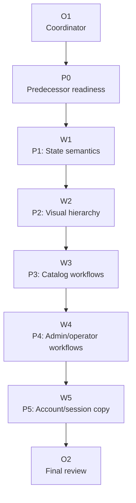

# Plan: Workflow Polish

Plan-ID: PLAN-workflow-polish

Status: Draft

Workers: 1

Filename: `.agents/plans/PLAN_workflow_polish.md`

## Readiness

- Plan readiness: Ready for an explicit implementation request; `M-UI-001` is complete and the predecessor-readiness packet is ready.
- Approved by:
- Approved at:
- Open questions: No.
- Implementation progress: Not started; P0-predecessor-readiness is `Ready` and implementation packets remain `Waiting`.

Use this plan after `M-UI-001` lands and the predecessor readiness packet confirms shell navigation, route context, and session-control behavior are stable enough for workflow polish. Creating or updating this plan is not implementation approval.

## Status History

- 2026-06-07T00:00:00+02:00: none -> Draft by Codex; initial active workflow polish plan created from `M-WORKFLOW-001`.
- 2026-06-07T22:53:57+02:00: legacy Waiting -> Draft by Codex; migrated to task-packet template and preserved the `M-UI-001` dependency.
- 2026-06-07T23:36:14+02:00: predecessor `M-UI-001` completed by `PLAN-production-ui-foundation`; P0 promoted to `Ready`.

## Goal

Polish daily catalog, account, admin, and operator workflows after the production shell foundation lands. The plan keeps the roadmap order: predecessor readiness, state semantics, visual hierarchy, catalog workflow polish, admin/operator workflow grouping, account/session copy, and final review.

## Non-Goals

- `M-UI-001` shell/navigation foundation implementation.
- `M-SMOKE-001` responsive smoke commands or canonical smoke evidence.
- `M-QUALITY-001` accessibility, smoke-gap promotion, or hardening thresholds.
- Backend API expansion, generated type edits, alternate transports, JWT or bearer-token assumptions, provider-specific OAuth paths, CORS-first behavior, or invented request fields.
- New generic command wrappers, broad workflow-state directories, global state frameworks, or reusable execution scaffolding.
- Marketing or landing-page treatment.

## Source Artifacts

- User request: Create an active plan for `M-WORKFLOW-001: Workflow Polish`.
- Roadmap refs: `ROADMAP.md` `M-WORKFLOW-001`, `E-STATE-001`, `E-WORKFLOW-001`, `E-CATALOG-001`, `E-OPS-001`, and `E-AUTH-001`.
- Design/spec refs: `docs/DESIGN.md`, `docs/specs/SPEC_public_catalog_workflow_polish.md`, `docs/specs/SPEC_admin_catalog_management.md`, `docs/specs/SPEC_admin_localization_management.md`, `docs/specs/SPEC_admin_user_management.md`, and `docs/specs/SPEC_operator_audit_surface.md`.
- Backend contract refs: `docs/backend/` for API behavior, auth, CSRF, localization, pagination, repeated filters, and update rules.
- Focused references: `AGENTS.md`, `.agents/references/planning.md`, `.agents/references/plan-execution.md`, `.agents/references/documentation.md`, `.agents/references/testing.md`, `.agents/references/reviews.md`, `.agents/references/architecture.md`, and `.agents/references/code-style.md`.
- Source files or tests: `src/App.tsx`, `src/index.css`, `src/ui/`, `src/catalog/`, `src/account/`, `src/admin/`, `src/operator/`, `src/api/`, and affected route/component/API tests.

Load only the artifacts needed for the assigned packet. Do not bulk-load generated contract files, source trees, archived plans, or roadmap archives unless a packet names them or an escalation trigger fires.

## Assumptions

- `M-UI-001` will leave shell navigation and route context stable enough for workflow polish.
- Existing mock API and route/component tests can cover most workflow polish without live credentials.
- Browser review is useful for materially changed layouts, but canonical smoke evidence remains selected by `M-SMOKE-001`.

## Open Questions

- None.

## Proposed Changes

- Normalize loading, empty, success, and error state presentation across implemented routes.
- Establish consistent page headers, content bands, and action placement without adding backend behavior.
- Improve public and admin catalog scanning, pagination, sorting, repeated filters, form prominence, action hierarchy, and versioned update protection.
- Group admin and operator controls by workflow, improve dense scanning, and preserve existing backend operations.
- Make account/session copy clearer while preserving metadata-driven login providers, logout, and account preference flows.
- Add route/component/API tests at the smallest useful layer for changed visible behavior and contract-sensitive request behavior.
- Update this plan, `ROADMAP.md`, specs, owner docs, or focused references only when their owned status, scope, or durable rules change.

## Contract And Repository Invariants

- Route API-facing behavior through `docs/backend/` and the imported backend contract artifacts before implementation.
- Do not invent endpoints, request fields, authentication flows, transport assumptions, provider-specific OAuth paths, pagination/filter semantics, or update concurrency rules.
- Preserve routine frontend/backend boundaries: same-origin `/api/**`, session-cookie auth, backend-provided session metadata, localized messages as display content, and stable-field branching.
- Preserve CSRF handling for unsafe writes with a real current session, Spring pagination, repeated filters, and book `version` values on updates.
- Do not branch on localized English response messages.
- Do not hand-edit `src/api/generated/openapi.ts`.
- Keep public catalog, account, admin, operator, and audit workflows structurally distinct in routes and tests.
- Use existing route, feature, API, routing, and UI helper boundaries before adding new abstractions.
- Move durable rules discovered during execution into the owning backend contract artifact, executable test, human doc, design guide, roadmap row, focused reference, or source file before this plan is complete.
- Run `git status --short` before edits and treat existing or unexpected changes as user-owned.
- Assign explicit write scopes to workers and keep unrelated user or parallel-worker changes intact.
- Commit only when the current request and plan checkpoint authorize it, and keep unrelated files out of the checkpoint commit.

## Progress Tracker

| Packet                          | Status  | Owner       | Depends On            | Last Updated | Notes                                                                  |
| ------------------------------- | ------- | ----------- | --------------------- | ------------ | ---------------------------------------------------------------------- |
| P0-predecessor-readiness        | Ready   | Coordinator | `M-UI-001` completion | 2026-06-07   | Confirm shell/navigation and route context are stable before execution |
| P1-state-semantics              | Waiting | Worker      | P0                    | 2026-06-07   | Covers `E-STATE-001`                                                   |
| P2-visual-hierarchy             | Waiting | Worker      | P1                    | 2026-06-07   | Covers `E-WORKFLOW-001`                                                |
| P3-catalog-workflows            | Waiting | Worker      | P2                    | 2026-06-07   | Covers `E-CATALOG-001`                                                 |
| P4-admin-operator-workflows     | Waiting | Worker      | P3                    | 2026-06-07   | Covers `E-OPS-001`                                                     |
| P5-account-session-copy         | Waiting | Worker      | P4                    | 2026-06-07   | Covers `E-AUTH-001`                                                    |
| P6-final-review-milestone-close | Waiting | Coordinator | P5                    | 2026-06-07   | Confirm owner drift, tests, and handoff evidence                       |

Use `Waiting` for these packets until `M-UI-001` is complete and predecessor readiness has been recorded. Do not promote downstream packets to `Ready` until their predecessor lands, validates, and any required checkpoint is complete.

## Task Packets

Use inline packets for this sequential plan. Repository-changing implementation packets require a fresh implementation worker subagent when the active tool contract allows worker delegation. Coordinator-owned packets may update this plan and roadmap status only within the write scope named below.

### Task Packet: P0-predecessor-readiness

Task id: P0-predecessor-readiness

Lane: exploration

Goal:

- Confirm `M-UI-001` has landed and leaves stable shell navigation, route context, and session-control behavior for workflow polish.

Initial context budget:

- Read first:
  - Plan header, `## Readiness`, `## Progress Tracker`, `## Execution Model`, this task packet, and this packet's `Result summary`.
  - `AGENTS.md`, `ROADMAP.md`, `docs/DESIGN.md`, `.agents/references/roadmap.md`, `.agents/references/planning.md`, `.agents/references/plan-execution.md`, and implemented `M-UI-001` diffs.
- Escalate to:
  - `src/App.tsx`, affected route tests, affected route source, and focused references only when readiness cannot be decided from the roadmap and completed diffs.

Write scope:

- `.agents/plans/PLAN_workflow_polish.md`.
- `ROADMAP.md` only if roadmap status or plan status needs updating.

Dependencies:

- `M-UI-001` completion.

Validation:

- `npm run lint:markdown`.
- `git diff --check`.
- No commit is authorized unless the current request or an approved checkpoint asks for one.

Escalation triggers:

- `M-UI-001` changes route ownership, shell assumptions, session controls, or navigation behavior enough that packet ownership is stale.
- Roadmap status conflicts with actual completed work.

Stop conditions:

- `M-UI-001` is still the active roadmap priority or not complete.
- Readiness requires product, design, or roadmap decisions not present in owner docs.
- Dirty changes appear inside the assigned write scope before editing.

Expected output:

- Plan readiness/status update or a replan note.
- Validation evidence from `.agents/references/testing.md`.
- Self-review evidence from `.agents/references/reviews.md`.
- Coordinator reconciliation.
- Blockers, review risks, and next action.

Result summary:

- Status: pending
- Worker:
- Changed files or reviewed diff:
- Validation evidence from `.agents/references/testing.md`:
- Self-review evidence from `.agents/references/reviews.md`:
- Commit:
- Coordinator reconciliation:
- Changelog/docs/spec/roadmap updates:
- Blockers:
- Review risks:
- Handoff notes and next action:

### Task Packet: P1-state-semantics

Task id: P1-state-semantics

Lane: implementation

Goal:

- Normalize loading, empty, success, and error state presentation across public, account, admin, and operator routes without branching on localized messages.

Initial context budget:

- Read first:
  - Plan header, `## Readiness`, `## Progress Tracker`, `## Execution Model`, this task packet, and this packet's `Result summary`.
  - `AGENTS.md`, `docs/DESIGN.md`, `ROADMAP.md` `E-STATE-001`, `.agents/references/architecture.md`, `.agents/references/code-style.md`, `.agents/references/testing.md`, `.agents/references/reviews.md`, current route/component tests, and existing state helpers in `src/ui/`.
- Escalate to:
  - Affected route components in `src/catalog/`, `src/account/`, `src/admin/`, and `src/operator/`; `src/api/` modules; `docs/backend/`; specs for changed routes.

Write scope:

- `src/ui/`.
- Affected route components in `src/catalog/`, `src/account/`, `src/admin/`, and `src/operator/`.
- Affected route/component tests.
- Focused CSS selectors in `src/index.css`.
- `.agents/plans/PLAN_workflow_polish.md` result summary.

Dependencies:

- P0-predecessor-readiness.

Validation:

- Targeted route/component tests during implementation when useful.
- `npm run lint`.
- `npm run typecheck`.
- `npm test`.
- `npm run build`.
- `git diff --check`.
- Commit checkpoint is authorized only after validation when the current request approves active-plan commits.

Escalation triggers:

- Existing state helpers cannot support two or more affected routes cleanly.
- A changed error state touches backend contract, localization, auth, or CSRF behavior.
- A visible state is too broad or ambiguous for roadmap plus design owner.

Stop conditions:

- Implementation would branch on localized display copy.
- Work requires changing backend API behavior or generated types.
- Dirty changes appear inside assigned write scope before editing.

Expected output:

- Changed files and reviewed diff.
- Validation evidence and self-review evidence.
- Result summary update.
- Commit identifier when authorized.
- Blockers, review risks, and next action.

Result summary:

- Status: pending
- Worker:
- Changed files or reviewed diff:
- Validation evidence from `.agents/references/testing.md`:
- Self-review evidence from `.agents/references/reviews.md`:
- Commit:
- Coordinator reconciliation:
- Changelog/docs/spec/roadmap updates:
- Blockers:
- Review risks:
- Handoff notes and next action:

### Task Packet: P2-visual-hierarchy

Task id: P2-visual-hierarchy

Lane: implementation

Goal:

- Establish consistent page headers, content bands, and action placement while preserving backend-backed flows.

Initial context budget:

- Read first:
  - Plan header, `## Readiness`, `## Progress Tracker`, `## Execution Model`, this task packet, and this packet's `Result summary`.
  - `AGENTS.md`, `docs/DESIGN.md`, `ROADMAP.md` `E-WORKFLOW-001`, `.agents/references/code-style.md`, `.agents/references/testing.md`, `.agents/references/reviews.md`, `src/App.tsx`, `src/index.css`, and P1 result summary.
- Escalate to:
  - Affected route components and tests; Browser review evidence when local layout verification is needed.

Write scope:

- `src/App.tsx`.
- `src/index.css`.
- Affected route components and route/component tests.
- `.agents/plans/PLAN_workflow_polish.md` result summary.

Dependencies:

- P1-state-semantics.

Validation:

- Targeted route/component tests during implementation when useful.
- Browser review for materially changed layouts when a local dev target is available; record URL and routes reviewed.
- `npm run lint`.
- `npm run typecheck`.
- `npm test`.
- `npm run build`.
- `git diff --check`.
- Commit checkpoint is authorized only after validation when the current request approves active-plan commits.

Escalation triggers:

- Layout changes expose responsive, focus, text-fit, or overlap risks.
- A design decision is not covered by `docs/DESIGN.md` and selected roadmap rows.

Stop conditions:

- Work would add hero, marketing, or decorative treatment.
- Work requires changing shell/navigation behavior owned by `M-UI-001`.
- Dirty changes appear inside assigned write scope before editing.

Expected output:

- Changed files and reviewed diff.
- Validation and browser-review evidence where applicable.
- Result summary update.
- Commit identifier when authorized.
- Blockers, review risks, and next action.

Result summary:

- Status: pending
- Worker:
- Changed files or reviewed diff:
- Validation evidence from `.agents/references/testing.md`:
- Self-review evidence from `.agents/references/reviews.md`:
- Commit:
- Coordinator reconciliation:
- Changelog/docs/spec/roadmap updates:
- Blockers:
- Review risks:
- Handoff notes and next action:

### Task Packet: P3-catalog-workflows

Task id: P3-catalog-workflows

Lane: implementation

Goal:

- Improve public and admin catalog table scanning, pagination, sorting, repeated filters, form prominence, action hierarchy, and versioned updates.

Initial context budget:

- Read first:
  - Plan header, `## Readiness`, `## Progress Tracker`, `## Execution Model`, this task packet, and this packet's `Result summary`.
  - `AGENTS.md`, `ROADMAP.md` `E-CATALOG-001`, `docs/DESIGN.md`, `docs/specs/SPEC_public_catalog_workflow_polish.md`, `docs/specs/SPEC_admin_catalog_management.md`, `.agents/references/testing.md`, `.agents/references/reviews.md`, and P1/P2 result summaries.
- Escalate to:
  - `docs/backend/`, `src/catalog/`, `src/admin/AdminCatalogPage.tsx`, `src/test/fixtures/catalog.ts`, focused CSS selectors, and matching tests.

Write scope:

- `src/catalog/`.
- `src/admin/AdminCatalogPage.tsx`.
- `src/test/fixtures/catalog.ts`.
- Matching catalog/admin tests.
- Focused CSS selectors in `src/index.css`.
- `.agents/plans/PLAN_workflow_polish.md` result summary.

Dependencies:

- P2-visual-hierarchy.

Validation:

- Targeted catalog/admin route tests during implementation when useful.
- `npm run lint`.
- `npm run typecheck`.
- `npm test`.
- `npm run build`.
- `git diff --check`.
- Commit checkpoint is authorized only after validation when the current request approves active-plan commits.

Escalation triggers:

- Catalog query serialization, repeated `category`, repeated `sort`, pagination, CSRF, or book `version` behavior is touched.
- Existing specs are insufficient for the changed visible behavior.

Stop conditions:

- Work would invent new catalog filters, backend fields, or request semantics.
- Public catalog and admin catalog ownership becomes unclear.
- Dirty changes appear inside assigned write scope before editing.

Expected output:

- Changed files and reviewed diff.
- Validation and self-review evidence.
- Result summary update.
- Commit identifier when authorized.
- Blockers, review risks, and next action.

Result summary:

- Status: pending
- Worker:
- Changed files or reviewed diff:
- Validation evidence from `.agents/references/testing.md`:
- Self-review evidence from `.agents/references/reviews.md`:
- Commit:
- Coordinator reconciliation:
- Changelog/docs/spec/roadmap updates:
- Blockers:
- Review risks:
- Handoff notes and next action:

### Task Packet: P4-admin-operator-workflows

Task id: P4-admin-operator-workflows

Lane: implementation

Goal:

- Group admin and operator controls by workflow, improve dense scanning, and preserve localization, user, operator, and audit operations.

Initial context budget:

- Read first:
  - Plan header, `## Readiness`, `## Progress Tracker`, `## Execution Model`, this task packet, and this packet's `Result summary`.
  - `AGENTS.md`, `ROADMAP.md` `E-OPS-001`, `docs/DESIGN.md`, `docs/specs/SPEC_admin_localization_management.md`, `docs/specs/SPEC_admin_user_management.md`, `docs/specs/SPEC_operator_audit_surface.md`, `.agents/references/testing.md`, `.agents/references/reviews.md`, and P1/P2 result summaries.
- Escalate to:
  - `docs/backend/`, `src/admin/AdminLocalizationPage.tsx`, `src/admin/AdminUsersPage.tsx`, `src/operator/OperatorPage.tsx`, matching tests, and focused CSS selectors.

Write scope:

- `src/admin/AdminLocalizationPage.tsx`.
- `src/admin/AdminUsersPage.tsx`.
- `src/operator/OperatorPage.tsx`.
- Matching tests.
- Focused CSS selectors in `src/index.css`.
- `.agents/plans/PLAN_workflow_polish.md` result summary.

Dependencies:

- P3-catalog-workflows.

Validation:

- Targeted admin/operator tests during implementation when useful.
- `npm run lint`.
- `npm run typecheck`.
- `npm test`.
- `npm run build`.
- `git diff --check`.
- Commit checkpoint is authorized only after validation when the current request approves active-plan commits.

Escalation triggers:

- Role gating, operator access, localization stable fields, audit query serialization, role replacement, or CSRF handling is touched.
- A route behavior is too broad for roadmap plus design owner.

Stop conditions:

- Work branches on localized display messages.
- Work weakens read-only operator behavior or admin access boundaries.
- Dirty changes appear inside assigned write scope before editing.

Expected output:

- Changed files and reviewed diff.
- Validation and self-review evidence.
- Result summary update.
- Commit identifier when authorized.
- Blockers, review risks, and next action.

Result summary:

- Status: pending
- Worker:
- Changed files or reviewed diff:
- Validation evidence from `.agents/references/testing.md`:
- Self-review evidence from `.agents/references/reviews.md`:
- Commit:
- Coordinator reconciliation:
- Changelog/docs/spec/roadmap updates:
- Blockers:
- Review risks:
- Handoff notes and next action:

### Task Packet: P5-account-session-copy

Task id: P5-account-session-copy

Lane: implementation

Goal:

- Keep login providers metadata-driven, make logout/account preference flows understandable, and reduce technical labels in primary UI.

Initial context budget:

- Read first:
  - Plan header, `## Readiness`, `## Progress Tracker`, `## Execution Model`, this task packet, and this packet's `Result summary`.
  - `AGENTS.md`, `ROADMAP.md` `E-AUTH-001`, `docs/DESIGN.md`, `docs/backend/`, `.agents/references/testing.md`, `.agents/references/reviews.md`, and P1/P2 result summaries.
- Escalate to:
  - `src/App.tsx`, `src/account/AccountProfile.tsx`, `src/api/session.ts`, `src/api/session.test.ts`, matching app/account tests, and focused CSS selectors.

Write scope:

- `src/App.tsx`.
- `src/account/AccountProfile.tsx`.
- `src/api/session.ts` only if helper coverage requires it.
- `src/api/session.test.ts`.
- Matching app/account tests.
- Focused CSS selectors in `src/index.css`.
- `.agents/plans/PLAN_workflow_polish.md` result summary.

Dependencies:

- P4-admin-operator-workflows.

Validation:

- Targeted app/account/session tests during implementation when useful.
- `npm run lint`.
- `npm run typecheck`.
- `npm test`.
- `npm run build`.
- `git diff --check`.
- Commit checkpoint is authorized only after validation when the current request approves active-plan commits.

Escalation triggers:

- Session metadata, login provider rendering, logout, account path metadata, or CSRF handling is touched.
- Existing tests cannot prove metadata-driven behavior.

Stop conditions:

- Work hard-codes provider paths or provider-specific OAuth behavior.
- Work invents login entry points absent from session metadata.
- Dirty changes appear inside assigned write scope before editing.

Expected output:

- Changed files and reviewed diff.
- Validation and self-review evidence.
- Result summary update.
- Commit identifier when authorized.
- Blockers, review risks, and next action.

Result summary:

- Status: pending
- Worker:
- Changed files or reviewed diff:
- Validation evidence from `.agents/references/testing.md`:
- Self-review evidence from `.agents/references/reviews.md`:
- Commit:
- Coordinator reconciliation:
- Changelog/docs/spec/roadmap updates:
- Blockers:
- Review risks:
- Handoff notes and next action:

### Task Packet: P6-final-review-milestone-close

Task id: P6-final-review-milestone-close

Lane: review

Goal:

- Confirm `M-WORKFLOW-001` acceptance criteria, owner alignment, validation evidence, and remaining smoke or quality-gate risks.

Initial context budget:

- Read first:
  - Plan header, `## Readiness`, `## Progress Tracker`, `## Execution Model`, this task packet, and all packet result summaries.
  - `AGENTS.md`, `ROADMAP.md`, `docs/DESIGN.md`, `docs/specs/`, `.agents/references/documentation.md`, `.agents/references/roadmap.md`, `.agents/references/testing.md`, and `.agents/references/reviews.md`.
- Escalate to:
  - Full diff from P1-P5, validation logs, source files, tests, and focused references needed to resolve owner drift.

Write scope:

- `.agents/plans/PLAN_workflow_polish.md`.
- `ROADMAP.md` only if milestone status changes.
- Owner docs only if durable rules need owner updates.

Dependencies:

- P5-account-session-copy.

Validation:

- Full baseline after integration: `npm run lint`, `npm run typecheck`, `npm test`, `npm run build`, and `git diff --check`.
- `npm run lint:markdown` and `git diff --check` for docs-only closeout edits.
- Commit checkpoint is authorized only after validation when the current request approves active-plan commits.

Escalation triggers:

- Validation evidence is missing, stale, or contradictory.
- Owner drift appears between roadmap, design, specs, source, tests, or focused references.
- Completed milestone work may need archive readiness review.

Stop conditions:

- Any P1-P5 packet is incomplete.
- Required validation has not passed or has no explicit skipped-check reason.
- Roadmap or archive state would change without assigned owner scope.

Expected output:

- Closeout findings and remaining risks.
- Validation and self-review evidence.
- Result summary update.
- Roadmap status update only when implementation is actually complete.
- Commit identifier when authorized.
- Next action.

Result summary:

- Status: pending
- Worker:
- Changed files or reviewed diff:
- Validation evidence from `.agents/references/testing.md`:
- Self-review evidence from `.agents/references/reviews.md`:
- Commit:
- Coordinator reconciliation:
- Changelog/docs/spec/roadmap updates:
- Blockers:
- Review risks:
- Handoff notes and next action:

## Execution Model

- `Workers: 1`; this is a sequential plan.
- P0 and P6 are coordinator-owned. P1 through P5 are repository-changing implementation packets and require a fresh implementation worker subagent when the active tool contract allows worker delegation.
- Research, exploration, planning, testing, and review subagents are optional unless a packet makes them mandatory.
- If required implementation worker subagents are unavailable, unauthorized by the active tool contract, or explicitly forbidden, stop before implementation and report the blocker instead of running the task locally.
- Dispatch only the plan header or readiness summary, execution graph, assigned task packet, relevant result summaries, and explicitly named governing artifacts or source files. Do not dispatch the full approved plan by default.
- Before write delegation, check current worktree state, reserve explicit write scopes, and keep write scopes disjoint.
- Each repository-changing packet must be implemented, validated through `.agents/references/testing.md`, self-reviewed through `.agents/references/reviews.md`, and committed when the plan checkpoint and current request authorize a commit before the next dependent packet starts.
- Before starting the next dependent packet, confirm the predecessor result summary records implementation status, validation evidence, self-review evidence, and any required commit identifier.
- Keep compact evidence in this plan. Do not paste raw test output, raw worker transcripts, browser logs, or bulky run logs.

## Long-Run Continuity

Use this checkpoint before starting each dependent packet, before a pause or handoff, and after any context transition.

- Resume docs reread:
  - After context compaction, interruption, resume, or handoff, reread the latest user request, `AGENTS.md`, this plan's header, `## Readiness`, `## Long-Run Continuity`, `## Execution Model`, the current task packet and result summary, `.agents/references/plan-execution.md`, `.agents/references/testing.md`, `.agents/references/reviews.md`, and the next action's exact owner docs or source files.
- Current task or wave: none; P0-predecessor-readiness is ready for a future workflow-polish implementation request.
- Completed commits: none for implementation packets.
- Plan status and readiness: `Draft`; ready for an explicit implementation request after `M-UI-001`.
- Validation and self-review state: authoring validation passed on 2026-06-07; implementation validation not started.
- Coordinator reconciliation state: not started.
- Changelog, docs, spec, roadmap, or plan updates: this plan migrated to task-packet template on 2026-06-07.
- Blockers or open questions: none currently blocking P0.
- Next action: run P0 when the user asks to implement `PLAN_workflow_polish.md`.
- Context handoff notes: do not start P1 until P0 lands, validates, and any required checkpoint is complete.

## Execution Graph

## Validation Plan

- Source implementation packets: `npm run lint`, `npm run typecheck`, `npm test`, `npm run build`, and `git diff --check`.
- Docs-only plan or roadmap status edits: `npm run lint:markdown` and `git diff --check`.
- Run targeted route/component tests during each packet when they provide faster feedback, then run the full baseline before the packet checkpoint.
- Use local browser review through the in-app Browser for materially changed visual hierarchy or workflow layout when a dev server is available; record the URL and routes reviewed. This is review evidence, not canonical `M-SMOKE-001` smoke evidence.
- Use `npm run dev:mock` for frontend-only layout and interaction review when the live sibling backend is not needed.
- Report skipped validation with reasons, including any environment mismatch from the Node or npm versions required in `package.json`.

## Review Expectations

- Review for documentation and owner drift before every handoff.
- Review for backend contract drift when API-facing wording, client code, generated types, auth/session/CSRF handling, localization, pagination, repeated filters, or update behavior changes.
- Review for security risk if auth, session, CSRF, permissions, headers, cookies, storage, redirects, or transport assumptions change beyond restating existing invariants.
- Review CSS/layout changes for overlap, text fit, focus visibility, dense scanning, and mobile/desktop coherence.
- Findings must be fixed, delegated, or recorded with owner and risk before calling a packet complete.

## Risks

- `M-UI-001` may change route ownership or shell assumptions enough that this plan needs another update before execution.
- Browser review can identify layout issues but is not canonical smoke evidence for `M-SMOKE-001`.
- Workflow polish can easily drift into backend behavior changes; keep API behavior contract-first and test-visible.
- Shared CSS or UI helper changes can affect multiple routes; keep write scopes explicit and validate broadly before checkpoints.

## Handoff Notes

- This plan remains waiting until `M-UI-001` lands.
- Original plan authoring validation from 2026-06-07 passed `npm run lint:markdown` and `git diff --check`.
- This migration preserves task order and scope while replacing the legacy plan-task tables with task packets.
- Do not mark `M-WORKFLOW-001` done until implementation packets and required validation have landed.
- Move completed milestone summaries to `docs/ROADMAP_ARCHIVE.md` only when the roadmap archive procedure is selected.
